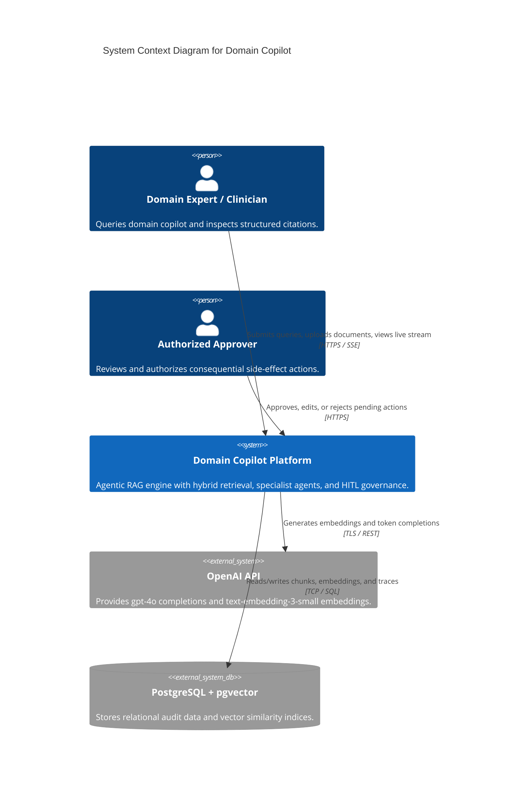
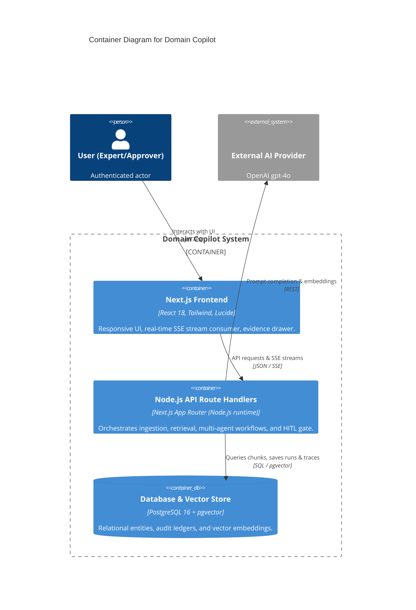
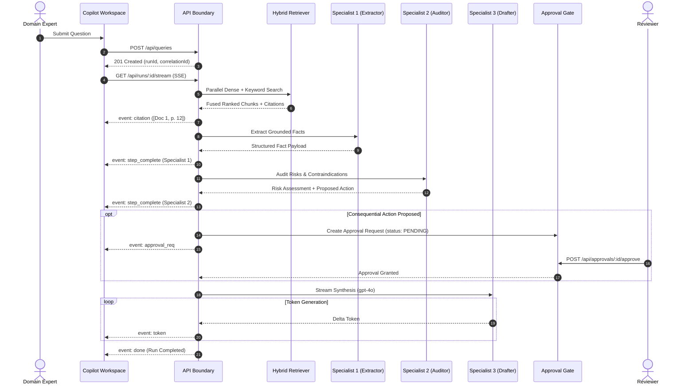
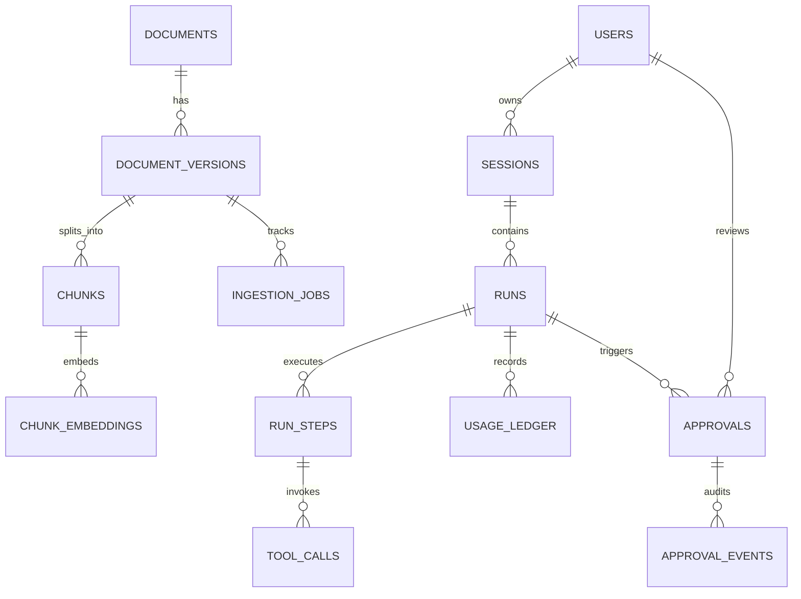

# System Architecture Document - Domain Copilot

## 1. C4 Model Level 1: System Context Diagram

---

## 2. C4 Model Level 2: Container Diagram

---

## 3. End-to-End Workflow Sequence Diagram (With Approval & Streaming)

---

## 4. Entity-Relationship (ER) Diagram

