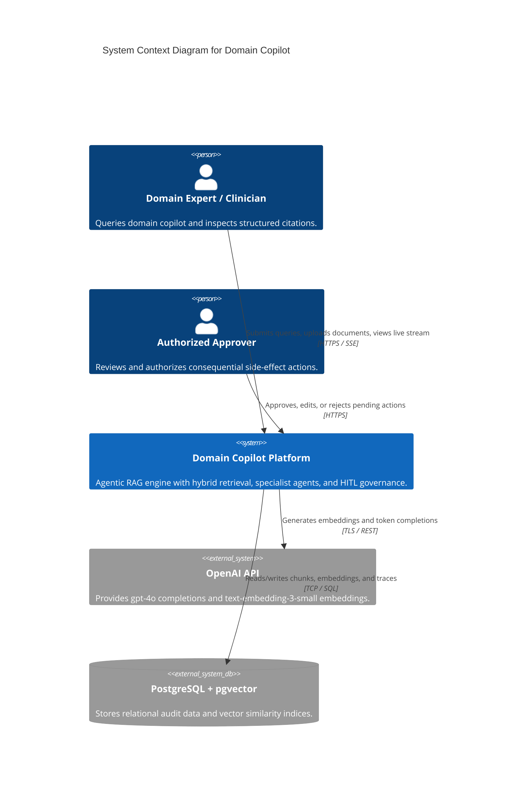
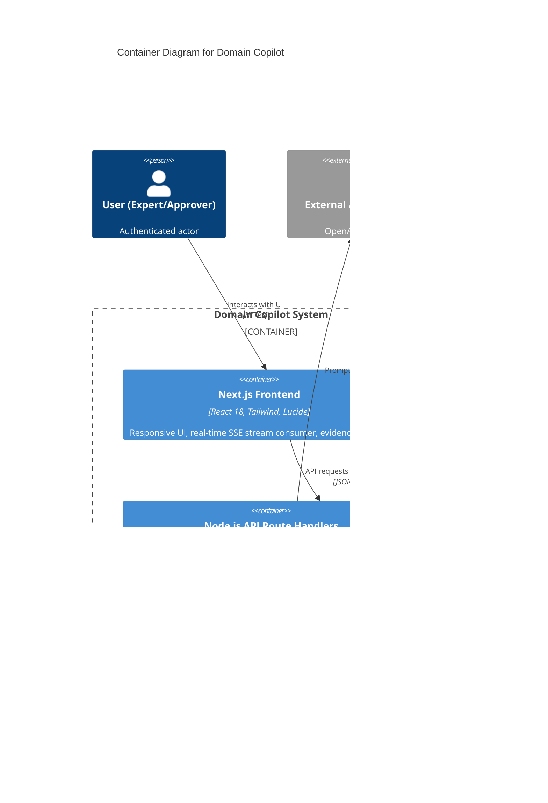
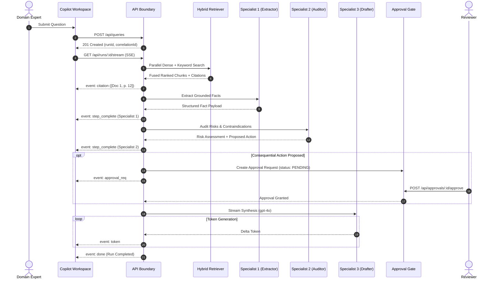
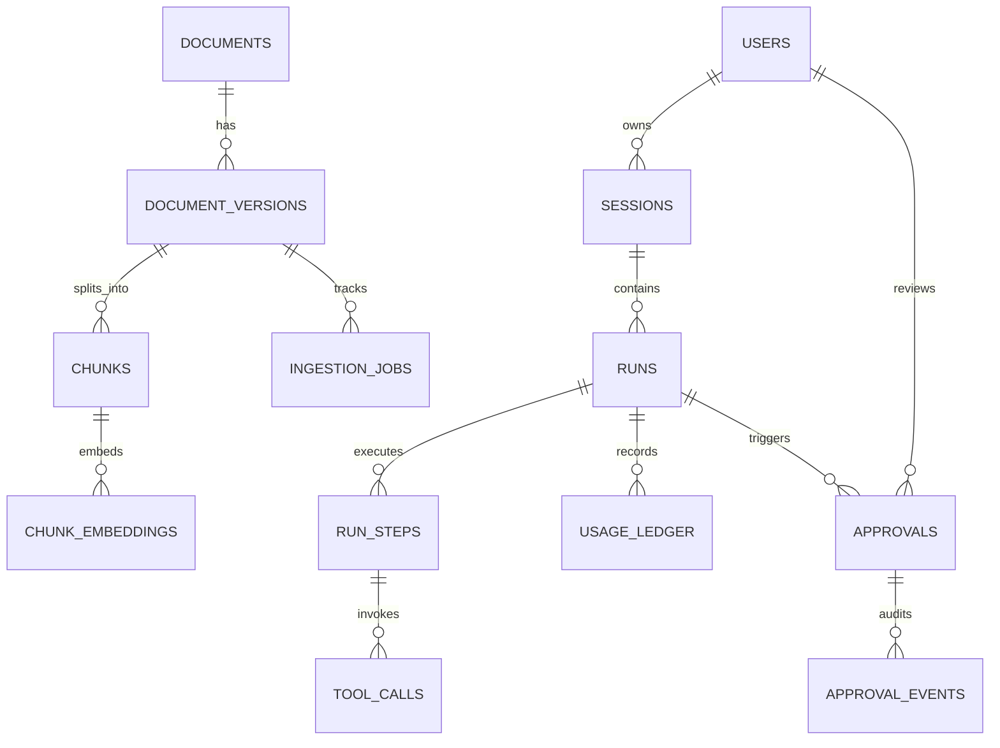
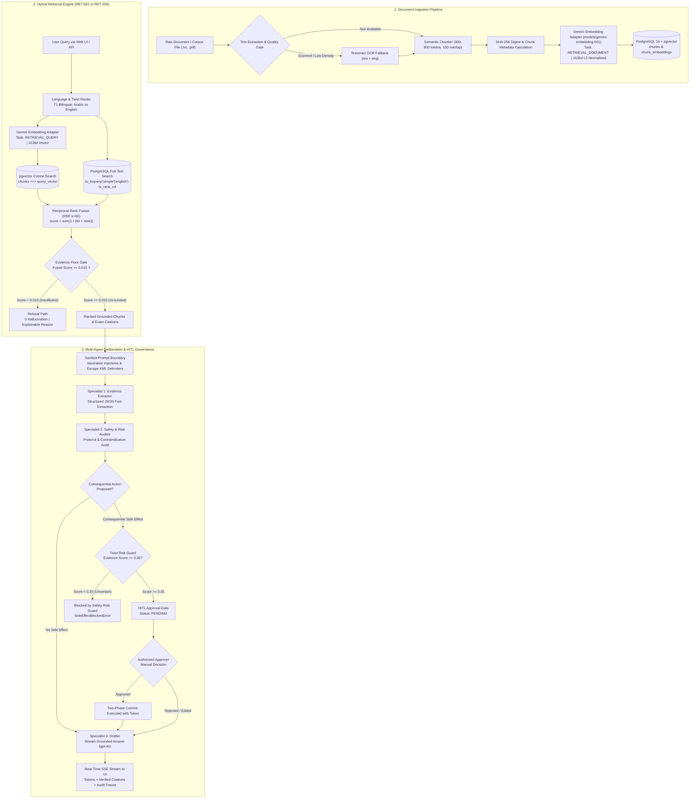
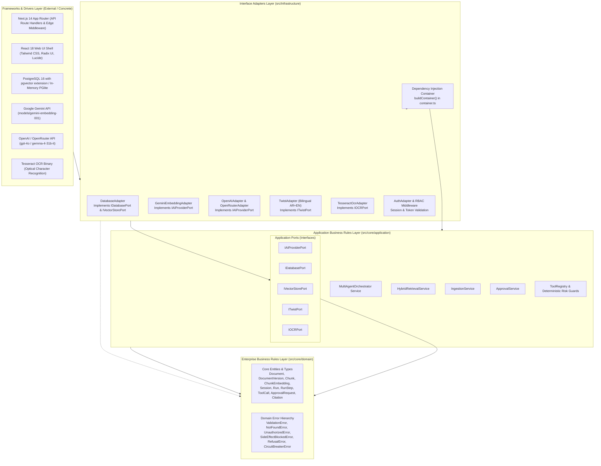

# System Architecture Document - Domain Copilot

## 1. C4 Model Level 1: System Context Diagram

---

## 2. C4 Model Level 2: Container Diagram

---

## 3. End-to-End Workflow Sequence Diagram (With Approval & Streaming)

---

## 4. Entity-Relationship (ER) Diagram

---

## 5. C4 Model Level 3: Component Diagram (API & Application Core)

The C4 Level 3 diagram shows the structural decomposition of the Next.js API boundary and the Clean Architecture application container, detailing component responsibilities and interaction with domain ports and infrastructure adapters.

```mermaid
C4Component
    title Component Diagram for Domain Copilot (Clean Architecture)

    Container_Boundary(api, "Domain Copilot Core System") {
        Component(route_queries, "Query Controller", "Next.js Route Handler (/api/queries)", "Validates input queries, checks RBAC session, and initiates orchestrator execution runs.")
        Component(route_stream, "Stream Controller", "Next.js Route Handler (/api/runs/[id]/stream)", "Streams real-time Server-Sent Events (SSE) for agent steps, tokens, and citations.")
        Component(route_approvals, "Approval Controller", "Next.js Route Handler (/api/approvals)", "Manages pending HITL approvals, reviews, two-phase commits, and rejections.")
        Component(route_docs, "Ingestion Controller", "Next.js Route Handler (/api/documents)", "Handles document uploads, quality gate validation, and ingestion jobs.")

        Component(orchestrator, "Multi-Agent Orchestrator", "Application Service", "Coordinates Extractor, Auditor, and Drafter specialist agents with circuit breaker caps.")
        Component(retrieval_svc, "Hybrid Retrieval Service", "Application Service", "Coordinates dense vector and sparse keyword search with RRF k=60 and refusal floors.")
        Component(ingestion_svc, "Ingestion Service", "Application Service", "Extracts text/OCR, creates semantic chunks, and generates embeddings.")
        Component(approval_svc, "Approval Service", "Application Service", "Enforces HITL two-phase commit gating for consequential side-effect actions.")
        Component(tool_reg, "Tool Registry & Security Guard", "Application Service", "Role-based tool allow-listing and deterministic twist risk guard enforcement.")

        Component(domain_ports, "Domain Ports & Entities", "Domain Core Layer", "Defines IAIProviderPort, IDatabasePort, IVectorStorePort, ITwistPort, IOCRPort, and core domain entities.")

        Component(ai_factory, "AI Provider Factory & Adapters", "Infrastructure Layer", "Resolves and drives OpenAI, OpenRouter, and Gemini embedding adapters.")
        Component(db_adapter, "Database & Vector Store Adapter", "Infrastructure Layer", "Implements IDatabasePort and IVectorStorePort on PostgreSQL 16 pgvector / PGlite.")
        Component(twist_adapter, "Bilingual Twist Adapter", "Infrastructure Layer", "Implements ITwistPort for Arabic/English detection, cross-lingual routing, and risk guards.")
        Component(ocr_adapter, "Tesseract OCR Adapter", "Infrastructure Layer", "Implements IOCRPort for optical character recognition on scanned PDFs.")
    }

    ContainerDb_Ext(postgres, "PostgreSQL 16 + pgvector", "Relational & Vector Store", "Stores documents, versions, chunks, chunk_embeddings, sessions, runs, approvals.")
    System_Ext(gemini_api, "Google Gemini API", "Embedding Service", "models/gemini-embedding-001 (1536d normalized vectors)")
    System_Ext(llm_api, "OpenAI / OpenRouter API", "LLM Generation", "Cloud model execution for specialist agent reasoning and drafting")

    Rel(route_queries, orchestrator, "Dispatches query run", "Method Call")
    Rel(route_approvals, approval_svc, "Manages approval lifecycle", "Method Call")
    Rel(route_docs, ingestion_svc, "Dispatches ingestion job", "Method Call")
    Rel(orchestrator, retrieval_svc, "Retrieves grounded evidence", "Method Call")
    Rel(orchestrator, tool_reg, "Executes permitted tools", "Method Call")
    Rel(orchestrator, approval_svc, "Checks / creates approval requests", "Method Call")
    Rel(orchestrator, ai_factory, "Invokes LLM specialists", "Method Call")
    Rel(orchestrator, twist_adapter, "Evaluates risk guard & language", "Method Call")
    Rel(retrieval_svc, ai_factory, "Generates query embeddings", "Method Call")
    Rel(retrieval_svc, db_adapter, "Executes vector cosine <=> and FTS ts_rank_cd", "Method Call")
    Rel(ingestion_svc, ai_factory, "Generates chunk embeddings", "Method Call")
    Rel(ingestion_svc, ocr_adapter, "Extracts scanned text if needed", "Method Call")
    Rel(ingestion_svc, db_adapter, "Persists chunks and vectors", "Method Call")
    Rel(tool_reg, twist_adapter, "Enforces safety risk guard floor (0.35)", "Method Call")
    Rel(ai_factory, gemini_api, "Generates 1536d embeddings", "HTTPS / REST")
    Rel(ai_factory, llm_api, "Generates completions", "HTTPS / REST")
    Rel(db_adapter, postgres, "Reads/writes relational & vector records", "SQL / pgvector")
```

---

## 6. End-to-End Data Flow Diagram

This diagram traces the exact data flow through document ingestion, hybrid vector/keyword retrieval, evidence threshold evaluation, specialist agent deliberation, and human-in-the-loop governance.

---

## 7. Clean Architecture Dependency Diagram

The dependency diagram illustrates the concentric Clean Architecture layer boundaries implemented across `src/core` and `src/infrastructure`. In accordance with the Dependency Inversion Principle, source code dependencies point strictly inward toward the Domain Core.

