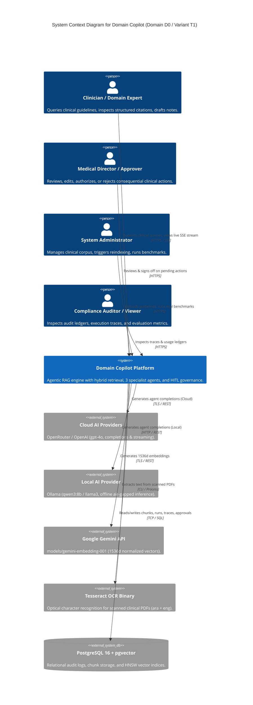
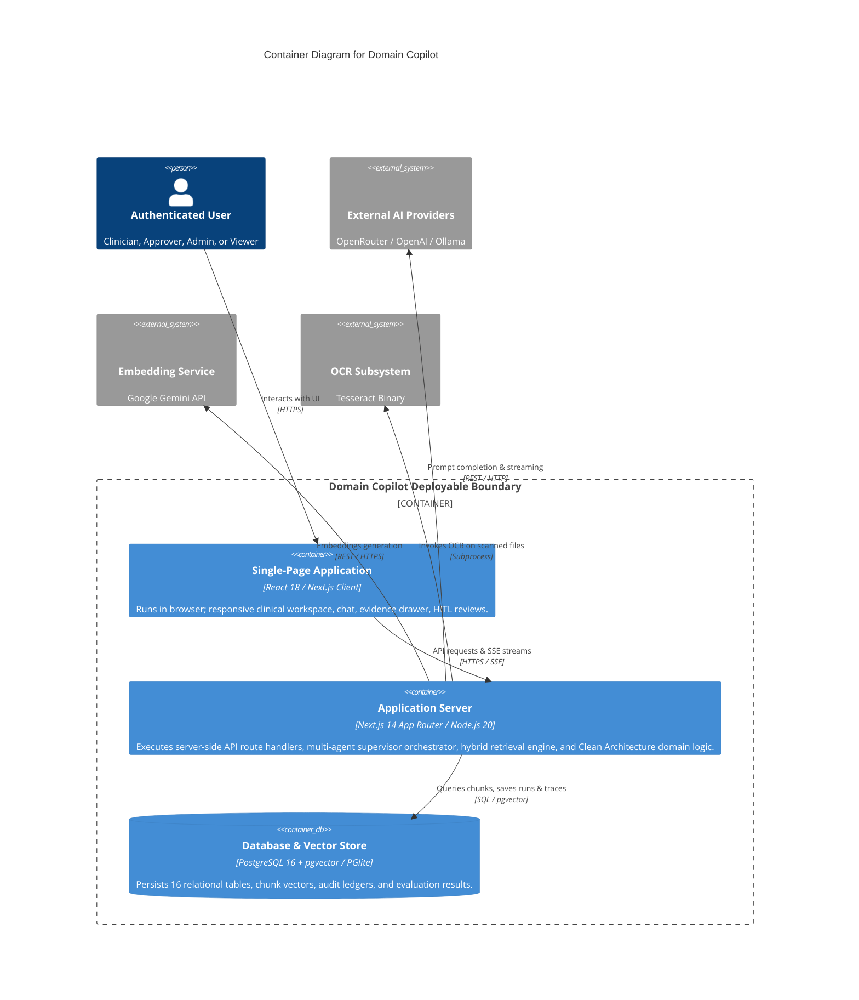
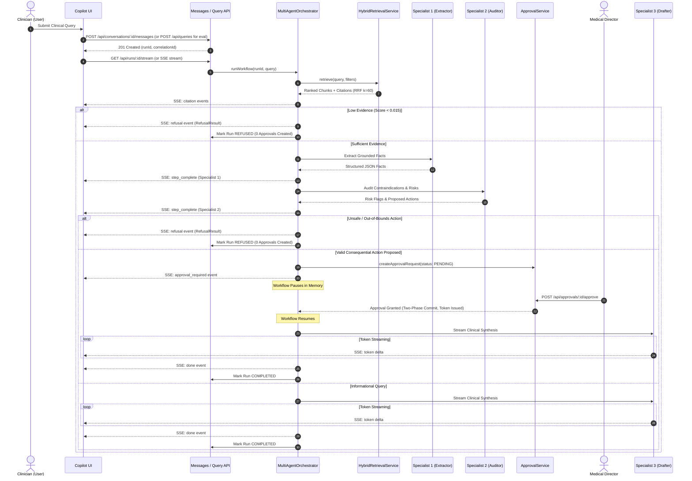
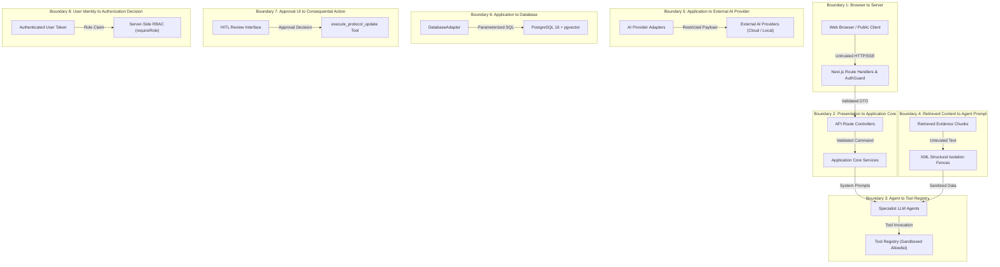
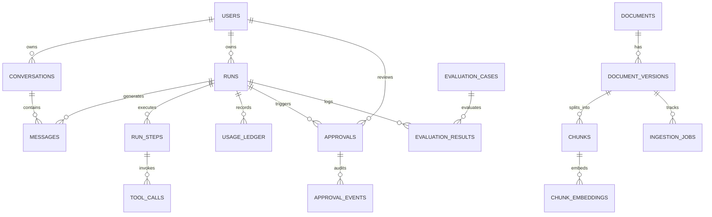

# Architecture

This document describes the implemented architecture of Domain Copilot through C4 views, trust boundaries, data flows, layer dependencies, agent-tool interfaces, persistence, streaming, and approval workflows (Domain D0: Healthcare, Variant T1: Bilingual Arabic + English).

## Table of Contents

- [1. Architecture Overview](#1-architecture-overview)
  - [1.1 System Purpose](#11-system-purpose)
  - [1.2 Architectural Principles](#12-architectural-principles)
  - [1.3 Domain and Assessment Variant](#13-domain-and-assessment-variant)
  - [1.4 Architecture Scope](#14-architecture-scope)
- [2. C4 Level 1: System Context](#2-c4-level-1-system-context)
  - [2.1 System Context Diagram](#21-system-context-diagram)
  - [2.2 Primary Actors](#22-primary-actors)
  - [2.3 External Systems](#23-external-systems)
  - [2.4 External Dependencies](#24-external-dependencies)
  - [2.5 Trust Boundaries](#25-trust-boundaries)
- [3. C4 Level 2: Container View](#3-c4-level-2-container-view)
  - [3.1 Container Diagram](#31-container-diagram)
  - [3.2 Single-Page Application Container](#32-single-page-application-container)
  - [3.3 Application Server Container](#33-application-server-container)
  - [3.4 Database & Vector Store Container](#34-database--vector-store-container)
  - [3.5 AI Provider Boundary](#35-ai-provider-boundary)
  - [3.6 Data / Storage Boundary](#36-data--storage-boundary)
  - [3.7 Authentication / Authorization Boundary](#37-authentication--authorization-boundary)
- [4. C4 Level 3: Component View](#4-c4-level-3-component-view)
  - [4.1 Application Components](#41-application-components)
  - [4.2 Retrieval Components](#42-retrieval-components)
  - [4.3 Agent Orchestration Components](#43-agent-orchestration-components)
  - [4.4 Approval Components](#44-approval-components)
  - [4.5 Evaluation Components](#45-evaluation-components)
  - [4.6 Observability Components](#46-observability-components)
  - [4.7 Provider Components](#47-provider-components)
- [5. Request and Data Flows](#5-request-and-data-flows)
  - [5.1 Query Lifecycle](#51-query-lifecycle)
  - [5.2 Ingestion Flow](#52-ingestion-flow)
  - [5.3 Retrieval Flow](#53-retrieval-flow)
  - [5.4 Agent Execution Flow](#54-agent-execution-flow)
  - [5.5 HITL Approval / Resume Flow](#55-hitl-approval--resume-flow)
  - [5.6 SSE Streaming Flow](#56-sse-streaming-flow)
  - [5.7 Evaluation Flow](#57-evaluation-flow)
- [6. Security and Trust Boundaries](#6-security-and-trust-boundaries)
  - [6.1 Trust Boundary Model](#61-trust-boundary-model)
  - [6.2 Boundary 1: Browser → Server](#62-boundary-1-browser--server)
  - [6.3 Boundary 2: Presentation Layer → Application Core](#63-boundary-2-presentation-layer--application-core)
  - [6.4 Boundary 3: Agent → Tool Registry](#64-boundary-3-agent--tool-registry)
  - [6.5 Boundary 4: Retrieved Document Content → Agent Prompt](#65-boundary-4-retrieved-document-content--agent-prompt)
  - [6.6 Boundary 5: Application → External AI Providers](#66-boundary-5-application--external-ai-providers)
  - [6.7 Boundary 6: Application → Database](#67-boundary-6-application--database)
  - [6.8 Boundary 7: Approval UI → Consequential Action Execution](#68-boundary-7-approval-ui--consequential-action-execution)
  - [6.9 Boundary 8: User Identity → Authorization Decision](#69-boundary-8-user-identity--authorization-decision)
- [7. Clean Architecture and Dependency Rules](#7-clean-architecture-and-dependency-rules)
  - [7.1 Layer Structure](#71-layer-structure)
  - [7.2 Dependency Direction](#72-dependency-direction)
  - [7.3 Ports and Adapters](#73-ports-and-adapters)
  - [7.4 Provider Abstraction](#74-provider-abstraction)
  - [7.5 Persistence Abstraction](#75-persistence-abstraction)
  - [7.6 Dependency Rule Validation](#76-dependency-rule-validation)
- [8. Data Architecture](#8-data-architecture)
  - [8.1 Logical Data Model](#81-logical-data-model)
  - [8.2 Relational Storage](#82-relational-storage)
  - [8.3 Vector Storage](#83-vector-storage)
  - [8.4 Evaluation Storage](#84-evaluation-storage)
  - [8.5 Run / Trace Storage](#85-run--trace-storage)
  - [8.6 Approval State](#86-approval-state)
  - [8.7 Data Relationships](#87-data-relationships)
- [9. Agentic Architecture](#9-agentic-architecture)
  - [9.1 Specialist Agents](#91-specialist-agents)
  - [9.2 Orchestrator](#92-orchestrator)
  - [9.3 Tool Registry](#93-tool-registry)
  - [9.4 Agent Tool Permissions](#94-agent-tool-permissions)
  - [9.5 Iteration and Timeout Controls](#95-iteration-and-timeout-controls)
  - [9.6 Failure / Degradation Paths](#96-failure--degradation-paths)
  - [9.7 Human-in-the-Loop Control](#97-human-in-the-loop-control)
- [10. Runtime and Streaming Architecture](#10-runtime-and-streaming-architecture)
  - [10.1 Request Handling](#101-request-handling)
  - [10.2 SSE](#102-sse)
  - [10.3 Cancellation](#103-cancellation)
  - [10.4 Progress Events](#104-progress-events)
  - [10.4.1 Twist Guard UI Presentation](#1041-twist-guard-ui-presentation)
  - [10.5 Conversation Persistence](#105-conversation-persistence)
  - [10.6 Approval Rehydration](#106-approval-rehydration)
- [11. Security Architecture](#11-security-architecture)
  - [11.1 Authentication](#111-authentication)
  - [11.2 Server-Side RBAC](#112-server-side-rbac)
  - [11.3 Prompt Injection Controls](#113-prompt-injection-controls)
  - [11.4 Indirect Injection Controls](#114-indirect-injection-controls)
  - [11.5 Tool Allowlisting](#115-tool-allowlisting)
  - [11.6 Side-Effect Controls](#116-side-effect-controls)
  - [11.7 Secret Handling](#117-secret-handling)
  - [11.8 Input / Token / Iteration Limits](#118-input--token--iteration-limits)
  - [11.9 Dependency / Supply Chain Controls](#119-dependency--supply-chain-controls)
- [12. Reliability and Failure Handling](#12-reliability-and-failure-handling)
  - [12.1 Provider Failure](#121-provider-failure)
  - [12.2 Retrieval Failure](#122-retrieval-failure)
  - [12.3 Database Failure](#123-database-failure)
  - [12.4 Stream Failure](#124-stream-failure)
  - [12.5 Authentication Failure](#125-authentication-failure)
  - [12.6 HITL Rejection](#126-hitl-rejection)
  - [12.7 Partial Degradation](#127-partial-degradation)
  - [12.8 Current Single-Instance Limitation](#128-current-single-instance-limitation)
- [13. Deployment and Environment Architecture](#13-deployment-and-environment-architecture)
  - [13.1 Local Development](#131-local-development)
  - [13.2 Docker / Compose](#132-docker--compose)
  - [13.3 Database / pgvector](#133-database--pgvector)
  - [13.4 AI Providers](#134-ai-providers)
  - [13.5 Environment Configuration](#135-environment-configuration)
  - [13.6 Environment-Dependent Capabilities](#136-environment-dependent-capabilities)
- [14. Architectural Decisions](#14-architectural-decisions)
  - [14.1 ADR-001 — Chunking and Retrieval](#141-adr-001--chunking-and-retrieval)
  - [14.2 ADR-002 — Orchestration State Machine](#142-adr-002--orchestration-state-machine)
  - [14.3 ADR-003 — PostgreSQL + pgvector](#143-adr-003--postgresql--pgvector)
  - [14.4 ADR-004 — Bilingual Twist Architecture](#144-adr-004--bilingual-twist-architecture)
- [15. Architecture Traceability](#15-architecture-traceability)
  - [15.1 ITI Requirements](#151-iti-requirements)
  - [15.2 Architecture Element -> Requirement Mapping](#152-architecture-element---requirement-mapping)
  - [15.3 Verification Evidence](#153-verification-evidence)
- [16. Architecture Limitations and Future Evolution](#16-architecture-limitations-and-future-evolution)
  - [16.1 Current Limitations](#161-current-limitations)
  - [16.2 Planned Scaling (Future Architecture)](#162-planned-scaling-future-architecture)
  - [16.3 Future Distributed State (Planned Architecture)](#163-future-distributed-state-planned-architecture)
  - [16.4 Future Infrastructure Evolution (Planned Architecture)](#164-future-infrastructure-evolution-planned-architecture)
- [17. Related Documentation](#17-related-documentation)

---

## 1. Architecture Overview

### 1.1 System Purpose

Domain Copilot is an evidence-grounded, agentic RAG platform engineered specifically for regulated, high-assurance clinical environments (**Domain D0: Healthcare**). The system accepts natural language clinical queries, retrieves verified clinical guidelines, audits proposed medical actions for contraindications, and drafts structured clinical notes with exact chunk-level citations. Consequential clinical operations are intercepted into a Human-in-the-Loop (HITL) approval queue before execution.

### 1.2 Architectural Principles

1. **Strict Dependency Inversion**: Domain entities and application use cases have zero dependencies on frameworks, databases, or external AI providers.
2. **Deterministic Evidence Grounding**: The system refuses to answer when retrieved evidence falls below the statistical confidence floor ($RRF < 0.015$).
3. **Separation of Deliberation Concerns**: Reasoning is factored into distinct specialists (Extraction, Auditing, Drafting) rather than a single monolithic prompt.
4. **Zero Ambient Authority**: Tool execution is strictly governed by agent-specific allowlists and cryptographic approval tokens for side effects.
5. **Unified Relational & Vector Persistence**: Relational entities and vector embeddings reside in a single PostgreSQL database with ACID transactional integrity.

### 1.3 Domain and Assessment Variant

- **Domain D0 (Healthcare)**: Focuses on clinical protocols, drug interaction formularies, dosage safety verification, and therapeutic documentation drafting.
- **Variant T1 (Bilingual Arabic + English)**: Native cross-lingual hybrid retrieval across Arabic and English clinical documents using shared multilingual vector embeddings and dual PostgreSQL Full-Text Search dictionaries (`english` and `simple`).

### 1.4 Architecture Scope

This document specifies the concrete implementation of the system on the `docs/submission-hardening` branch. It distinguishes between:
- **Implemented**: Code and configurations verified in the repository.
- **Configured / Environment-Dependent**: Features requiring external host binaries or cloud API keys.
- **Planned / Future**: Architectural enhancements designed for enterprise scale but not yet implemented.

---

## 2. C4 Level 1: System Context

### 2.1 System Context Diagram



### 2.2 Primary Actors

- **Clinician / Domain Expert (`EXPERT`)**: Practicing physician, nurse practitioner, or pharmacist querying protocols. Has query, streaming, and citation inspection privileges.
- **Medical Director / Authorized Reviewer (`APPROVER`)**: Senior clinician authorized to review and resolve pending approval requests for consequential actions.
- **System Administrator (`ADMIN`)**: IT operations lead managing corpus uploads, re-indexing, user access, and benchmark runs.
- **Compliance Auditor (`VIEWER`)**: Read-only auditor inspecting completed runs, waterfall traces, and financial usage ledgers.

### 2.3 External Systems

- **Cloud AI Providers**: OpenRouter (default cloud proxy) and OpenAI API providing reasoning models (`gpt-4o`).
- **Local AI Provider**: Ollama daemon (`http://localhost:11434`) providing local LLM execution (`qwen3:8b`, `llama3:latest`).
- **Embedding Provider**: Google Gemini API (`models/gemini-embedding-001`) generating 1536-dimensional L2-normalized embeddings.
- **OCR Engine**: Tesseract OCR command-line utility for scanned document extraction.

### 2.4 External Dependencies

- PostgreSQL 16 with `pgvector` and `uuid-ossp` extensions (or in-process `@electric-sql/pglite` for local development).
- Node.js runtime (v20+) executing Next.js 14 App Router server handlers.

### 2.5 Trust Boundaries

The system enforces strict trust boundaries between untrusted public clients, authenticated internal API routes, sandboxed application agents, and external AI vendors. Detailed boundary specifications are provided in [Section 6](#6-security-and-trust-boundaries).

---

## 3. C4 Level 2: Container View

### 3.1 Container Diagram



### 3.2 Single-Page Application Container

- **Runtime**: Client-side web browser executing compiled React 18 SPA code served by Next.js.
- **Styling & Accessibility**: Tailwind CSS, Radix UI primitives, Lucide icons.
- **Bilingual & RTL**: Dynamic `dir="auto"` attribute and RTL typography styles supporting Arabic script alongside English.
- **Client Features**: Real-time SSE token accumulation, evidence drawer, interactive HITL review cards, and runs inspector.

### 3.3 Application Server Container

- **Runtime**: Single Node.js 20 process executing Next.js 14 App Router.
- **Responsibilities**: Enforces authentication and server-side RBAC, manages long-lived SSE connections, coordinates the multi-agent supervisor orchestrator, executes the hybrid retrieval pipeline, and hosts the Clean Architecture domain core.
- **Internal Layering**: The container internally isolates code according to Clean Architecture rules:
  - *Presentation Controllers*: Next.js Route Handlers (`src/app/api/*`).
  - *Application Services*: `MultiAgentOrchestrator`, `HybridRetrievalService`, `ApprovalService`, `ToolRegistry` (`src/core/application`).
  - *Domain Core*: Entities, Value Objects, Domain Errors, and Port Interfaces (`src/core/domain`).
  - *Infrastructure Adapters*: Database, AI, OCR, and Auth adapters (`src/infrastructure`).

### 3.4 Database & Vector Store Container

- **Runtime**: Containerized PostgreSQL 16 instance with the `pgvector` extension (or in-process `@electric-sql/pglite` for local development and unit tests).
- **Responsibilities**: Stores relational entities, versioned documents, text chunks, HNSW vector similarity indices, run telemetry, and HITL approval states.

### 3.5 AI Provider Boundary

All LLM interactions are decoupled behind `IAIProviderPort`. The application never imports vendor SDKs directly; instances are created via `resolveAIProvider()` in `ai-provider.factory.ts`.

### 3.6 Data / Storage Boundary

All persistence is decoupled behind `IDatabasePort` and `IVectorStorePort`. SQL queries, HNSW indexing, and transactions are encapsulated in `DatabaseAdapter`.

### 3.7 Authentication / Authorization Boundary

Stateless signed HMAC/JWT tokens (`SESSION_TTL_SECONDS = 86400`) are validated server-side by `requireAuth()`, `requireRole()`, and `requireRunAccess()`.

---

## 4. C4 Level 3: Component View

### 4.1 Application Components

The structural component decomposition within the **Application Server Container** (`src/core/application` and `src/app/api`):

```mermaid
C4Component
    title Component Diagram for Domain Copilot Application Server Container

    Container_Boundary(server, "Domain Copilot Application Server Container") {
        Component(route_messages, "Conversation Controller", "Next.js Route Handler (/api/conversations/[id]/messages)", "Primary conversational endpoint: validates session, orchestrates multi-agent workflow, streams tokens.")
        Component(route_queries, "Evaluation Query Controller", "Next.js Route Handler (/api/queries)", "Stateless evaluation endpoint for benchmark execution and programmatic batch queries.")
        Component(route_stream, "Stream Controller", "Next.js Route Handler (/api/runs/[id]/stream)", "Manages SSE connection, delivers progress, tokens, citations.")
        Component(route_approvals, "Approval Controller", "Next.js Route Handler (/api/approvals/*)", "Processes human review decisions: approve, edit-approve, reject.")
        Component(route_docs, "Ingestion Controller", "Next.js Route Handler (/api/documents)", "Handles document uploads, quality gates, and chunk indexing.")

        Component(orchestrator, "Multi-Agent Orchestrator", "Application Service", "Coordinates Extractor, Auditor, and Drafter with iteration caps & timeouts.")
        Component(retrieval_svc, "Hybrid Retrieval Service", "Application Service", "Executes dense + keyword search with RRF k=60 and refusal floor.")
        Component(approval_svc, "Approval Service", "Application Service", "Manages two-phase commit, cryptographic hashes, and audit events.")
        Component(tool_reg, "Tool Registry & Risk Guard", "Application Service", "Enforces per-agent tool allowlists and side-effect approval tokens.")

        Component(domain_ports, "Domain Ports & Entities", "Domain Core Layer", "Defines IAIProviderPort, IDatabasePort, IVectorStorePort, ITwistPort, IOCRPort.")

        Component(ai_factory, "AI Provider Factory", "Infrastructure Layer", "Resolves active LLM and embedding adapters based on configuration.")
        Component(db_adapter, "Database Adapter", "Infrastructure Layer", "Implements IDatabasePort & IVectorStorePort for PostgreSQL/PGlite.")
        Component(twist_adapter, "Bilingual Twist Adapter", "Infrastructure Layer", "Implements ITwistPort for Unicode detection and FTS routing.")
    }

    ContainerDb_Ext(postgres, "PostgreSQL 16 + pgvector", "Database Container", "Stores relational records & vector embeddings")
    System_Ext(llm_api, "AI Provider API", "External Service", "Cloud / Local LLM completions")
    System_Ext(gemini_api, "Gemini API", "External Service", "1536d vector generation")

    Rel(route_queries, orchestrator, "Dispatches query run", "Method Call")
    Rel(route_stream, orchestrator, "Subscribes to progress & tokens", "Method Call")
    Rel(route_approvals, approval_svc, "Dispatches reviewer decision", "Method Call")
    Rel(route_docs, db_adapter, "Saves chunks & embeddings", "Method Call")

    Rel(orchestrator, retrieval_svc, "Queries evidence", "Method Call")
    Rel(orchestrator, tool_reg, "Executes permitted tools", "Method Call")
    Rel(orchestrator, approval_svc, "Creates approval requests", "Method Call")
    Rel(orchestrator, ai_factory, "Invokes LLM specialists", "Method Call")

    Rel(retrieval_svc, db_adapter, "Executes vector <=> & FTS ts_rank_cd", "Method Call")
    Rel(retrieval_svc, ai_factory, "Generates query embedding", "Method Call")
    Rel(ai_factory, llm_api, "HTTP completions", "REST")
    Rel(ai_factory, gemini_api, "HTTP embeddings", "REST")
    Rel(db_adapter, postgres, "Reads/writes SQL records", "SQL")
```



### 4.2 Retrieval Components

- **`HybridRetrievalService` (`src/core/application/retrieval/retrieval.service.ts`)**:
  - `validateFilterScope()`: Validates metadata filters (`documentId`, `version`, `source`, `pageRange`).
  - `retrieve()`: Coordinates parallel dense search and dual-dictionary FTS search, executes RRF fusion ($k=60$), evaluates the low-evidence refusal floor ($RRF < 0.015$), and generates structured `Citation` objects.

### 4.3 Agent Orchestration Components

- **`MultiAgentOrchestrator` (`src/core/application/agents/orchestrator.service.ts`)**:
  - Supervisor state machine executing 3 specialists sequentially.
  - Enforces `MAX_ITERATIONS = 5` and per-step timeout circuit breakers ($30,000$ms cloud, $60,000$ms local).
  - Handles Zod schema validation with automatic prompt self-correction retry loops.
  - Pauses workflow on consequential actions and saves state to in-memory `globalPausedStates`.

### 4.4 Approval Components

- **`ApprovalService` (`src/core/application/approvals/approval.service.ts`)**:
  - Creates `ApprovalRequest` with SHA-256 digest of parameters.
  - Manages transitions: `PENDING` $\rightarrow$ `APPROVED` | `EDIT_APPROVED` | `REJECTED`.
  - Enforces mandatory non-empty justification for rejections.
  - Records immutable audit entries in `approval_events`.

### 4.5 Evaluation Components

- **`eval-runner.js` / `eval-report.js` (`scripts/`)**:
  - Automated benchmark harness running 33 golden test cases.
  - Evaluates retrieval recall @ 5, groundedness, refusal precision, latency, and costs.
  - Persists results to disk and updates `evaluation_results` in the database.

### 4.6 Observability Components

- **Usage Ledger & Trace Inspector**:
  - `usage_ledger`: Records token consumption and calculated financial costs per LLM/embedding call.
  - `run_steps`: Records step-by-step latency, input payloads, and output payloads.
  - Telemetry endpoint `/api/runs/[id]/retrieval-trace` exposes candidate rank distributions.

### 4.7 Provider Components

- **`AIProviderFactory` (`src/infrastructure/ai/ai-provider.factory.ts`)**:
  - Resolves `IAIProviderPort` implementations based on `AI_PROVIDER` (`openai`, `openrouter`, `ollama`).
  - Resolves embedding implementations based on `EMBEDDING_PROVIDER` (`gemini`, `openai`).
  - Enforces vector space compatibility, rejecting mixed embedding configurations.

---

## 5. Request and Data Flows

### 5.1 Query Lifecycle



### 5.2 Ingestion Flow

```
[Raw File (.pdf, .txt)] ──► [MIME & Format Gate] ──► [Direct Extract / Tesseract OCR]
                                                              │
                                                              ▼
[PostgreSQL 16 + pgvector] ◄── [Gemini Embedding] ◄── [Semantic Chunker (300-800 tok)]
```
1. Client uploads document via `POST /api/documents`.
2. Format validation and SHA-256 content hashing prevent duplicate ingestion.
3. If scanned, Tesseract OCR extracts text; otherwise direct parsing occurs.
4. Text is cleaned and segmented into 300–800 token chunks with 100-token overlap.
5. Gemini embedding adapter generates 1536d normalized vectors.
6. Chunks and embeddings are stored in `chunks` and `chunk_embeddings`.

### 5.3 Retrieval Flow

1. User query is converted to a 1536d vector via Gemini `RETRIEVAL_QUERY`.
2. Parallel execution:
   - Dense search: pgvector cosine distance (`<=>`), returning top-10 candidates.
   - Sparse search: PostgreSQL FTS using `english` and `simple` dictionaries, returning top-10 candidates.
3. Candidates are fused via Reciprocal Rank Fusion: $RRF(d) = \sum \frac{w_m}{60 + r_m(d)}$.
4. Refusal Gate: If top candidate $RRF < 0.015$, retrieval triggers safe refusal.
5. Top-5 candidates are packaged into structured `Citation` objects.

### 5.4 Agent Execution Flow

1. Extractor (`Clinical Evidence Extractor`): Processes query + citations; outputs structured JSON facts.
2. Auditor (`Contraindication & Safety Auditor`): Analyzes facts for contraindications and dosage thresholds; flags consequential actions.
3. Drafter (`Therapeutic Protocol Drafter`): Generates grounded clinical synthesis with bracketed citations matching chunk IDs.

### 5.5 HITL Approval / Resume Flow

1. Specialist 2 identifies a proposed action.
2. Safety Evaluation:
   - If the action is unsafe, dangerous, or out-of-bounds (e.g. lethal overdose, contraindicated therapy), the orchestrator triggers an immediate `RefusalResult`, halts execution, and creates ZERO `ApprovalRequest` records.
   - If the action is a valid, guideline-conforming consequential protocol update, the orchestrator calls `ApprovalService.createApprovalRequest()`; run enters `APPROVAL_PENDING` with SHA-256 parameter digest.
3. Client receives `approval_required` event; UI renders approval card in `/reviews` and in the conversation timeline.
4. Reviewer submits decision (`approve`, `edit-approve`, `reject` with reason).
5. On approval, `ApprovalService` issues an HMAC-SHA256 `approvalToken` with a 15-minute TTL; `orchestrator.resumeWorkflow()` resumes from the Drafter step.
6. The consequential tool (`execute_protocol_update`) verifies the approval token and parameter hash before execution.

### 5.6 SSE Streaming Flow

1. Client connects to `GET /api/runs/[id]/stream`.
2. Server establishes `text/event-stream` response with `no-cache` headers.
3. Orchestrator emits progress events (`step_start`, `step_complete`, `citation`, `token`, `done`).
4. On client cancellation (`POST /api/runs/[id]/cancel`), `RunControllerRegistry` triggers `AbortController.abort()`, severing LLM inference immediately.

### 5.7 Evaluation Flow

1. Evaluation harness (`scripts/eval-runner.js`) loads 33 benchmark test cases.
2. Executes each case against the active retrieval and agent pipeline.
3. Calculates Recall @ 5, groundedness, refusal precision, latency, and costs.
4. Updates `evaluation_results` in the database and writes `fixtures/eval-results.json`.

---

## 6. Security and Trust Boundaries

### 6.1 Trust Boundary Model



### 6.2 Boundary 1: Browser → Server
- **What Crosses It**: Raw HTTP request bodies, URL query parameters, authentication cookies/headers, SSE stream subscriptions.
- **Why It Is a Trust Boundary**: The browser is an untrusted client environment outside server control that can be manipulated by malicious actors or compromised client scripts.
- **Implemented Controls**: TLS/HTTPS transport encryption; Next.js App Router route handlers; strict Zod schema validation on JSON request bodies; stateless signed HMAC/JWT authentication tokens; HTTP-only cookie support; and CORS restrictions.

### 6.3 Boundary 2: Presentation Layer → Application Core
- **What Crosses It**: In-process method calls, parsed command objects, verified `AuthenticatedUser` context.
- **Why It Is a Trust Boundary**: Isolates HTTP/transport-specific controllers from domain business logic, ensuring that raw, unvalidated HTTP request objects never enter the application core.
- **Implemented Controls**: Clean Architecture ports and adapters; request DTO validation via Zod schemas before application service invocation; dependency inversion via `src/core/application/container.ts`.

### 6.4 Boundary 3: Agent → Tool Registry
- **What Crosses It**: Tool invocation requests containing tool names and JSON argument payloads.
- **Why It Is a Trust Boundary**: LLM reasoning outputs are probabilistic and cannot be granted ambient execution authority or unrestricted system access.
- **Implemented Controls**: `ToolRegistry` enforces a static `allowedAgents` allowlist per tool. Unauthorized invocations throw a `ValidationError`. Read-only tools cannot mutate state. Consequential tools mandate a cryptographically verified `approvalToken`.

### 6.5 Boundary 4: Retrieved Document Content → Agent Prompt
- **What Crosses It**: Ingested chunk text, document metadata, section headers, and clinical citations.
- **Why It Is a Trust Boundary**: Ingested third-party documents are external data that could harbor indirect prompt injection attacks designed to hijack agent instructions.
- **Implemented Controls**: Structural XML isolation fences (`<clinical_evidence>`); explicit system prompt boundary instructions commanding models to treat chunk content strictly as passive data; separation of fact extraction (`Specialist 1`) from clinical drafting (`Specialist 3`).

### 6.6 Boundary 5: Application → External AI Providers
- **What Crosses It**: Sanitized prompts, system instructions, context chunks, and API credentials (in HTTP headers).
- **Why It Is a Trust Boundary**: External cloud AI providers (OpenRouter, OpenAI, Google Gemini) operate outside the organization's infrastructure boundary.
- **Implemented Controls**: Outbound requests are restricted by application data-handling controls; no intentional real-patient PII is part of the project corpus; API keys are managed exclusively via server-side environment variables; `IAIProviderPort` enables local offline inference via Ollama without code changes.

### 6.7 Boundary 6: Application → Database
- **What Crosses It**: SQL queries, vector embedding similarity searches, relational audit records, and approval states.
- **Why It Is a Trust Boundary**: The database stores sensitive clinical records, chunk vectors, and immutable audit ledgers; arbitrary query execution could compromise data integrity.
- **Implemented Controls**: Parameterized SQL queries and typed repository methods in `DatabaseAdapter` mitigate SQL injection risk; no dynamic string concatenation in SQL statements; strict foreign-key constraints; and least-privilege database user configuration.

### 6.8 Boundary 7: Approval UI → Consequential Action Execution
- **What Crosses It**: Human approval decisions (`approve`, `edit-approve`, `reject`), modified payload parameters, and rejection rationale.
- **Why It Is a Trust Boundary**: Consequential actions (e.g. protocol updates, dosage modifications) have direct clinical safety implications and must never execute without verified human authorization.
- **Implemented Controls**: Two-phase commit protocol; generation of a SHA-256 parameter digest upon proposal; issuance of a cryptographic `approvalToken` upon approver sign-off; strict comparison of the executed payload hash against the approved hash in `execute_protocol_update`, blocking execution with `SideEffectBlockedError` if tampered; mandatory non-empty rejection rationale logging.

### 6.9 Boundary 8: User Identity → Authorization Decision
- **What Crosses It**: User roles (`ADMIN`, `APPROVER`, `EXPERT`, `VIEWER`), user IDs, and run ownership identifiers.
- **Why It Is a Trust Boundary**: Prevents privilege escalation, unauthorized approval sign-offs, and cross-tenant/cross-user data access.
- **Implemented Controls**: Server-side RBAC validation via `requireRole(req, allowedRoles)` on every API route handler; run ownership verification via `requireRunAccess(req, runId)` restricting execution access to the owning user or authorized administrative roles; rejection of unauthorized roles with HTTP 403 Forbidden before triggering use cases; strict test-auth bypass guard (`ALLOW_TEST_AUTH="true"` only active when `NODE_ENV === "test"`).

---

## 7. Clean Architecture and Dependency Rules

### 7.1 Layer Structure

The system enforces concentric Clean Architecture layers:

```
┌─────────────────────────────────────────────────────────────┐
│ 1. Frameworks & Drivers (Presentation & External Concrete)  │
│    Next.js 14 App Router, React 18, PostgreSQL 16, APIs     │
│  ┌───────────────────────────────────────────────────────┐  │
│  │ 2. Interface Adapters (src/infrastructure)             │  │
│  │    DatabaseAdapter, AI Adapters, AuthGuard, Twist     │  │
│  │  ┌─────────────────────────────────────────────────┐  │  │
│  │  │ 3. Application Business Rules (src/core/app)     │  │  │
│  │  │    MultiAgentOrchestrator, RetrievalService,    │  │  │
│  │  │    ApprovalService, ToolRegistry, Ports         │  │  │
│  │  │  ┌───────────────────────────────────────────┐  │  │  │
│  │  │  │ 4. Enterprise Domain Core (src/core/dom)  │  │  │  │
│  │  │  │    Entities, Value Objects, Domain Errors │  │  │  │
│  │  │  └───────────────────────────────────────────┘  │  │  │
│  │  └─────────────────────────────────────────────────┘  │  │
│  └───────────────────────────────────────────────────────┘  │
└─────────────────────────────────────────────────────────────┘
```

### 7.2 Dependency Direction

Source code dependencies point strictly inward toward the Domain Core:
- `src/core/domain`: Depends on nothing.
- `src/core/application`: Depends only on `src/core/domain`.
- `src/infrastructure`: Implements port interfaces defined in `src/core/application/ports/`.
- `src/app`: Depends on application services resolved through `src/core/application/container.ts`.

### 7.3 Ports and Adapters

| Port Interface | Primary Adapter Implementation | Role |
|---|---|---|
| `IAIProviderPort` | `OpenAIProviderAdapter`, `OpenRouterProviderAdapter`, `OllamaProviderAdapter`, `GeminiEmbeddingAdapter` | LLM completions, streaming, tool calls, and vector embeddings. |
| `IDatabasePort` | `DatabaseAdapter` | Relational persistence for runs, steps, chunks, approvals, and usage ledgers. |
| `IVectorStorePort` | `DatabaseAdapter` | Nearest-neighbor vector similarity search and FTS keyword search. |
| `ITwistPort` | `BilingualTwistAdapter` | Arabic/English language detection, cross-lingual routing, and risk guards. |
| `IOCRPort` | `TesseractOcrAdapter` | Optical character recognition on scanned PDFs. |

### 7.4 Provider Abstraction

AI vendors are resolved dynamically at runtime via `ai-provider.factory.ts`. The application core remains completely decoupled from vendor SDKs, enabling zero-code provider switching via environment variables.

### 7.5 Persistence Abstraction

`DatabaseAdapter` abstracts both PostgreSQL 16 `pgvector` and `@electric-sql/pglite`. Application services invoke repository methods without coupling to raw SQL or ORM frameworks. Parameterized queries and typed repository methods mitigate SQL injection risk.

### 7.6 Dependency Rule Validation

Architecture boundary compliance is continuously enforced by `scripts/lint-arch.js` in CI/CD, verifying that inner layers never import outer layer modules.

---

## 8. Data Architecture

### 8.1 Logical Data Model



### 8.2 Relational Storage

The PostgreSQL schema (`src/infrastructure/db/schema.sql`) implements 16 relational tables with strict foreign-key integrity and indexing:
- `users`: User identity, password hash, role (`ADMIN`, `APPROVER`, `EXPERT`, `VIEWER`), status.
- `conversations`: Chat sessions owned by users (`id`, `user_id`, `title`, `created_at`, `updated_at`).
- `messages`: Chronological conversation messages (`id`, `conversation_id`, `role`, `content`, `refusal_data`, `created_at`).
- `documents`: Document inventory, MIME types, content checksums, status.
- `document_versions`: Version-aware document metadata, language, page count.
- `chunks`: Segmented text chunks with section, page, clause, and token count.
- `chunk_embeddings`: 1536d vector embeddings with HNSW cosine index.
- `ingestion_jobs`: Extraction, chunking, and embedding pipeline status.
- `runs`: Inspectable execution records with correlation IDs and final status.
- `run_steps`: Step-by-step latency, input/output JSON payloads.
- `tool_calls`: Tool names, argument hashes, execution status, and outcomes.
- `approvals`: HITL approval records with original and approved payload hashes.
- `approval_events`: Immutable audit timeline of approval decisions.
- `usage_ledger`: Token usage and calculated financial costs per model call.
- `evaluation_cases`: 33-case golden benchmark test set.
- `evaluation_results`: Benchmark execution metrics and regression history.

### 8.3 Vector Storage

- **Table**: `chunk_embeddings`
- **Vector Dimension**: 1536 (L2-normalized).
- **Index**: HNSW index using `vector_cosine_ops`:
  ```sql
  CREATE INDEX idx_embeddings_vector_cosine ON chunk_embeddings 
  USING hnsw (vector vector_cosine_ops);
  ```

### 8.4 Evaluation Storage

Benchmark test cases and results are stored in `evaluation_cases` and `evaluation_results`, enabling first-load hydration of evaluation metrics without re-running the benchmark suite.

### 8.5 Run / Trace Storage

Execution telemetry is captured across `runs`, `run_steps`, and `tool_calls`, providing an end-to-end waterfall audit trail for every clinical query.

### 8.6 Approval State

Approvals transition through a formal state machine (`PENDING` $\rightarrow$ `APPROVED` | `EDIT_APPROVED` | `REJECTED`) with immutable event logging in `approval_events`.

### 8.7 Data Relationships

Cascading deletes ensure clean lifecycle cleanup on document or conversation removal, while audit records (`runs`, `approvals`, `usage_ledger`) retain foreign-key integrity for regulatory compliance.

---

## 9. Agentic Architecture

### 9.1 Specialist Agents

```
┌─────────────────────────────────────────────────────────────┐
│                 Supervisor Orchestrator                     │
├─────────────────────────────────────────────────────────────┤
│ 1. Specialist 1: Clinical Evidence Extractor                │
│    - Extracts grounded facts, vitals, and parameters        │
│    - Tool: cross_reference_clause (read-only)               │
│    - Schema: ExtractorOutputSchema                          │
│                                                             │
│ 2. Specialist 2: Contraindication & Safety Auditor          │
│    - Audits drug interactions, policy compliance, risks     │
│    - Tool: calculate_risk_index (read-only)                 │
│    - Schema: AuditorOutputSchema                            │
│                                                             │
│ 3. Specialist 3: Therapeutic Protocol Drafter               │
│    - Streams synthesized guidance with bracketed citations  │
│    - Tool: verify_citation_integrity (read-only)            │
│    - Schema: DrafterOutputSchema                            │
└─────────────────────────────────────────────────────────────┘
```

### 9.2 Orchestrator

The `MultiAgentOrchestrator` governs agent progression:
- Coordinates sequential execution: Extractor $\rightarrow$ Auditor $\rightarrow$ [Approval Gate] $\rightarrow$ Drafter.
- Enforces circuit breaker limits (`MAX_ITERATIONS = 5`).
- Enforces per-step timeout circuit breakers ($30,000$ms cloud, $60,000$ms local Ollama).
- Emits real-time SSE progress events to the client.

### 9.3 Tool Registry

`ToolRegistry` (`src/core/application/agents/tool-registry.ts`) manages 4 registered tools:
1. `cross_reference_clause`: Read-only clause reference lookup.
2. `calculate_risk_index`: Read-only statistical risk index calculation.
3. `verify_citation_integrity`: Read-only chunk excerpt verification.
4. `execute_protocol_update`: Consequential clinical protocol modification (requires valid `approvalToken`).

### 9.4 Agent Tool Permissions

| Tool Name | Type | Allowed Agents | Requires HITL Approval? |
|---|---|---|---|
| `cross_reference_clause` | Read-Only | Clinical Evidence Extractor, Supervisor | No |
| `calculate_risk_index` | Read-Only | Contraindication & Safety Auditor, Supervisor | No |
| `verify_citation_integrity` | Read-Only | Therapeutic Protocol Drafter, Supervisor | No |
| `execute_protocol_update` | Side-Effecting | Supervisor ONLY | **Yes (`approvalToken` mandatory)** |

### 9.5 Iteration and Timeout Controls

- **Iteration Cap**: Each specialist loop is bounded by 5 iterations. Exceeding this cap throws a `ValidationError` circuit breaker.
- **Step Timeout**: Enforced via `Promise.race()`. Cloud providers timeout at 30 seconds; local Ollama timeouts at 60 seconds.

### 9.6 Failure / Degradation Paths

- **Zod Schema Failure**: Failed schema parsing triggers automatic prompt correction and retry up to 5 times.
- **Timeout Activation**: Step timeout terminates the active agent and marks the run `FAILED`.
- **Low Evidence**: $RRF < 0.015$ immediately bypasses all specialists, emitting a standardized refusal message.

### 9.7 Human-in-the-Loop Control

The orchestrator inspects Specialist 2's output and the Twist Risk Guard via `isConsequentialHITLRequired()`:
- **Unsafe / Out-of-Bounds Actions**: Clinical overdose directives or hard contraindications trigger an upfront refusal via the Refusal Normalization Pipeline, creating ZERO `ApprovalRequest` records.
- **Valid Consequential Protocol Updates**: Legitimate protocol changes requiring human clinical oversight trigger an approval record, pause execution, and wait for reviewer resolution.

---

## 10. Runtime and Streaming Architecture

### 10.1 Request Handling

1. Client sends `POST /api/conversations/[id]/messages` (or stateless evaluation query via `POST /api/queries`) with query text and optional scope filters.
2. Server validates auth, creates a `Run` record with status `STARTED`, and returns `runId` and `correlationId`.
3. Client receives progressive SSE stream via `POST /api/conversations/[id]/messages/stream` or `GET /api/runs/[id]/stream`.

### 10.2 SSE

- Delivered via native `text/event-stream` protocol.
- Events: `run_started`, `step_start`, `step_complete`, `citation`, `token`, `approval_required`, `done`, `error`.
- Bypasses server-side buffering, delivering tokens with sub-second latency.

### 10.3 Cancellation

- Client issues `POST /api/runs/[id]/cancel`.
- Server retrieves the `AbortController` from `runControllerRegistry` and calls `.abort()`.
- Active LLM streaming is severed; run status transitions to `CANCELLED`.

### 10.4 Progress Events

Progress events update the client UI in real time, displaying active agent badges, checklist indicators, and millisecond latency timers.

### 10.4.1 Twist Guard UI Presentation

In the Copilot chat timeline (`src/app/copilot/page.tsx`):
- **Grounded Responses**: Displays a prominent green `TWIST GUARD: PASSED` badge confirming that evidence grounding and side-effect safety thresholds were met.
- **Refusal Responses**: On low-evidence, out-of-corpus, or clinical safety refusal, the Twist Guard badge is omitted, and the UI displays a dedicated Refusal Card detailing the refusal category, explanation, and safe guidance suggestions. Failed safety checks are never presented as successful states.

### 10.5 Conversation Persistence

Messages, citations, and run IDs are persisted to `conversations` and `messages`. Navigating across conversations rehydrates the full history from the database.

### 10.6 Approval Rehydration

Pending approvals rehydrate seamlessly from database records across page navigation, displaying active review cards in `/reviews` and within the copilot chat timeline.

---

## 11. Security Architecture

### 11.1 Authentication

- Stateless HMAC/JWT session tokens (`SESSION_TTL_SECONDS = 86400`).
- Transmitted via HTTP-only cookies or `Authorization: Bearer <token>`.
- Test bypass (`ALLOW_TEST_AUTH="true"`) strictly restricted to `NODE_ENV === "test"`.

### 11.2 Server-Side RBAC

- Enforced in API route handlers via `requireRole(req, allowedRoles)`.
- 4 roles: `ADMIN`, `APPROVER`, `EXPERT`, `VIEWER`.
- Verified across 37 automated test scenarios in `scripts/test-auth-rbac.js`.

### 11.3 Prompt Injection Controls

- User query encapsulated within `<user_query>` XML boundaries.
- System prompt hardening instructs models to treat input strictly as data.
- Achieved 100% interception across the 7 adversarial test cases in the automated security benchmark (`scripts/test-security.js`).

### 11.4 Indirect Injection Controls

- Text extracted from ingested documents is sanitized and wrapped in `<clinical_evidence>` tags.
- Fact extraction is decoupled from response drafting, mitigating instruction execution risk from retrieved document content.

### 11.5 Tool Allowlisting

- Tool execution is checked against static `allowedAgents` in `ToolRegistry`.
- Unauthorized invocations are rejected with `ValidationError`.

### 11.6 Side-Effect Controls

- Side-effecting tools require an `approvalToken`.
- The token is cryptographically bound to the SHA-256 hash of the approved payload.
- Any discrepancy aborts execution with `SideEffectBlockedError`.

### 11.7 Secret Handling

- Credentials managed via externalized environment variables (`.env`).
- Pre-commit scanning and `.gitignore` mitigate credential leakage into version control.

### 11.8 Input / Token / Iteration Limits

- Max query length: 4,000 characters.
- Max upload file size: 50 MB.
- Max iterations: 5 per agent step.
- Max token caps: Extractor (1,024), Auditor (1,024), Drafter (4,096).

### 11.9 Dependency / Supply Chain Controls

- Pinned dependencies in `package-lock.json`.
- Automated architectural linting (`scripts/lint-arch.js`) enforcing Clean Architecture layer boundaries.

---

## 12. Reliability and Failure Handling

### 12.1 Provider Failure

- **Detection**: HTTP 429, 5xx, or network timeouts from cloud AI providers.
- **Handling**: Error caught by orchestrator; run marked `FAILED` with explainable notification.
- **Operational Fallback**: Environment can be configured to point to local Ollama via `AI_PROVIDER=ollama` without code modifications.

### 12.2 Retrieval Failure

- **Detection**: Zero matching chunks or database connectivity errors.
- **Handling**: Low-evidence refusal gate ($RRF < 0.015$) returns a standardized refusal message to mitigate ungrounded clinical hallucination.

### 12.3 Database Failure

- **Detection**: Connection pool exhaustion or network disconnect.
- **Handling**: Database driver reconnection logic; embedded PGlite used for local development and offline testing.

### 12.4 Stream Failure

- **Detection**: Client disconnect or network interruption.
- **Handling**: `req.signal.onabort` triggers `RunControllerRegistry.cancelRun()`, severing LLM inference and freeing server resources.

### 12.5 Authentication Failure

- **Detection**: Expired, missing, or tampered session tokens.
- **Handling**: Route handlers return HTTP 401/403; client redirects to login portal.

### 12.6 HITL Rejection

- **Handling**: Reviewer submits mandatory rejection reason; run transitions to `REJECTED`, logging the clinical rationale to `approval_events`.

### 12.7 Partial Degradation

- **OCR Unavailable**: System falls back to direct PDF text extraction with a logged warning if Tesseract is not installed.
- **Embedding Degraded**: Step timeout absorbs transient latency up to 30 seconds.

### 12.8 Current Single-Instance Limitation

Paused workflow states are maintained in process-level memory (`globalPausedStates`). In multi-instance deployments without sticky sessions, process restarts require state externalization.

---

## 13. Deployment and Environment Architecture

### 13.1 Local Development

- **Runtime**: Node.js 20+, Next.js 14 App Router (`npm run dev`).
- **Database**: Embedded `@electric-sql/pglite` with vector extension.
- **Configuration**: Local `.env` file.

### 13.2 Docker / Compose

- **Compose Configuration**: `docker-compose.yml` providing PostgreSQL 16 with `pgvector` pre-compiled.
- **Application Container**: Multi-stage Dockerfile compiling Next.js standalone server.

### 13.3 Database / pgvector

- **Container Image**: `pgvector/pgvector:pg16`
- **Extensions Initialized**: `uuid-ossp`, `vector`.

### 13.4 AI Providers

- **Cloud Mode**: OpenRouter (`OPENROUTER_API_KEY`) or OpenAI (`OPENAI_API_KEY`).
- **Local Mode**: Ollama running locally on `http://localhost:11434`.
- **Embedding Mode**: Google Gemini API (`GEMINI_API_KEY`) generating 1536d vectors.

### 13.5 Environment Configuration

Managed via `.env` (configured) and `.env.example` (template) specifying:
- `AI_PROVIDER`, `EMBEDDING_PROVIDER`, `DATABASE_URL`, `JWT_SECRET`, `STEP_TIMEOUT_MS`.

### 13.6 Environment-Dependent Capabilities

- **Tesseract OCR**: Requires local `tesseract-ocr` binary and language packs (`ara`, `eng`).
- **Local LLM**: Requires running Ollama daemon with pulled models (`qwen3:8b` or `llama3:latest`).

---

## 14. Architectural Decisions

The foundational architectural decisions governing this platform are documented in individual Architectural Decision Records:

### 14.1 ADR-001 — Chunking and Retrieval
- **Document**: [ADR-001: Structure-Aware Chunking & Reciprocal Rank Fusion (RRF)](./adr/ADR-001-chunking-retrieval.md)
- **Summary**: Adopts structure-aware chunking (300–800 tokens, 100 overlap) and dual-channel hybrid retrieval (pgvector cosine `<=>` + PostgreSQL FTS `ts_rank_cd`) fused via RRF ($k=60$). Rejects fixed 500-character chunking and dense-only search.

### 14.2 ADR-002 — Orchestration State Machine
- **Document**: [ADR-002: Supervisor Orchestration State Machine Pattern](./adr/ADR-002-orchestration-state-machine.md)
- **Summary**: Implements a deterministic Supervisor State Machine coordinating 3 specialist agents with Zod output contracts, 5-iteration caps, and 30s/60s step timeouts. Rejects autonomous agent swarms and monolithic prompts.

### 14.3 ADR-003 — PostgreSQL + pgvector
- **Document**: [ADR-003: Relational Vector Storage via PostgreSQL + pgvector](./adr/ADR-003-pgvector-storage.md)
- **Summary**: Consolidates relational audit data, chunks, and vector embeddings into a unified PostgreSQL 16 database with the `pgvector` extension. Rejects standalone vector databases (Pinecone/Qdrant) to avoid cross-database distributed transaction failures.

### 14.4 ADR-004 — Bilingual Twist Architecture
- **Document**: [ADR-004: Mandatory Twist (T1: Bilingual AR+EN) Port-Adapter Architecture](./adr/ADR-004-twist-architecture.md)
- **Summary**: Establishes `ITwistPort` and `BilingualTwistAdapter` providing Unicode language detection (`[\u0600-\u06FF]`), dual FTS dictionaries (`english`/`simple`), and shared multilingual embedding space for cross-lingual retrieval. Rejects runtime translation APIs.

---

## 15. Architecture Traceability

### 15.1 ITI Requirements

The architecture maps directly to the official ITI Technical Assessment requirements for Domain D0 (Healthcare) and Variant T1 (Bilingual AR+EN):

### 15.2 Architecture Element -> Requirement Mapping

| Architecture Element | ITI Requirement Code | Requirement Description | Verification Evidence |
|---|---|---|---|
| **Document Ingestion Engine** | `ING-001` | Multi-format upload parser and validation (PDF, TXT) with MIME and size gates. | `scripts/test-corpus.js`<br>`scripts/test-ingestion-epic.js` |
| **Document Cleaning Pipeline** | `ING-002` | Text normalization, OCR integration via Tesseract for scanned documents. | `ocr.adapter.ts`<br>`scripts/test-ingestion-epic.js` |
| **Structure-Aware Chunker** | `ING-003` | Header-, paragraph-, and section-aware chunking (300–800 tokens, 100 overlap). | `chunker.ts`<br>`ADR-001-chunking-retrieval.md` |
| **Embedding Generation** | `ING-004` | 1536d normalized vector embeddings via Google Gemini embedding adapter. | `gemini-embedding.adapter.ts`<br>`scripts/test-corpus.js` |
| **Vector Indexing** | `ING-005` | PostgreSQL `pgvector` HNSW cosine similarity index (`vector_cosine_ops`). | `schema.sql`<br>`ADR-003-pgvector-storage.md` |
| **Document Versioning** | `ING-006` | SHA-256 content hashing and idempotent re-ingestion versioning. | `database.adapter.ts`<br>`scripts/test-ingestion-epic.js` |
| **Ingestion Reporting** | `ING-007` | Ingestion status tracking and error reporting in `ingestion_jobs`. | `schema.sql`<br>`src/app/api/documents/route.ts` |
| **Corpus Seeder** | `ING-008` | Healthcare clinical guidelines corpus floor ($\ge 30$ docs, $\ge 150$ pages). | `data/corpus/`<br>`scripts/test-corpus.js` |
| **Hybrid Retrieval Engine** | `RET-001` | Parallel dense (pgvector `<=>`) + sparse FTS (`ts_rank_cd`) with RRF fusion ($k=60$). | `retrieval.service.ts`<br>`scripts/test-pg-hybrid-engine.js` |
| **Metadata Filtering** | `RET-002` | Structured scope filtering by `documentId`, `version`, and `pageRange`. | `retrieval.service.ts`<br>`scripts/test-retrieval.js` |
| **Structured Citations** | `RET-003` | Chunk-level citations with document name, section, page number, and text excerpt. | `retrieval.service.ts`<br>`src/components/citations/` |
| **Low-Evidence Refusal Gate** | `RET-004` | Mathematical refusal floor ($RRF < 0.015$) ensuring safe refusal on ungrounded queries. | `retrieval.service.ts`<br>`scripts/test-unit.js` |
| **Retrieval Trace Inspector** | `RET-005` | Per-query candidate score waterfall and ranking debug endpoint (`/api/runs/[id]/retrieval-trace`). | `src/app/api/runs/[id]/retrieval-trace/` |
| **Retrieval Evaluation** | `RET-006` | Empirical retrieval evaluation achieving Recall@5 $\ge 80\%$. | `scripts/eval-runner.js`<br>`scripts/test-retrieval.js` |
| **Typed Agent Contracts** | `AGT-001` | Zod schema validation on all agent input and output payloads with self-correction. | `agent-schemas.ts`<br>`scripts/test-integration.js` |
| **Supervisor Orchestrator** | `AGT-002` | Deterministic state machine coordinating 3 specialists with iteration caps & timeouts. | `orchestrator.service.ts`<br>`ADR-002-orchestration-state-machine.md` |
| **Specialist 1: Extractor** | `AGT-003` | Clinical Evidence Extractor extracting grounded facts and vitals. | `specialist-prompts.ts`<br>`scripts/test-integration.js` |
| **Specialist 2: Auditor** | `AGT-004` | Contraindication & Safety Auditor flagging drug interactions and consequential actions. | `specialist-prompts.ts`<br>`scripts/test-integration.js` |
| **Specialist 3: Drafter** | `AGT-005` | Therapeutic Protocol Drafter streaming synthesized guidance with bracketed citations. | `specialist-prompts.ts`<br>`scripts/test-integration.js` |
| **Tool Sandboxing & Registry** | `AGT-006` | Role-based tool allowlisting, read-only guards, and side-effect approval tokens. | `tool-registry.ts`<br>`scripts/test-unit.js` |
| **Approval Persistence** | `HITL-001` | Two-phase commit approval request persistence with SHA-256 payload digest. | `approval.service.ts`<br>`schema.sql` |
| **Review Queue UI** | `HITL-002` | Dedicated `/reviews` dashboard with pending action cards and difference viewers. | `src/app/reviews/`<br>`scripts/test-browser-hydration.js` |
| **Approve Action Flow** | `HITL-003` | Unmodified approval flow issuing `approvalToken` and resuming workflow execution. | `approval.service.ts`<br>`scripts/test-hitl-continuity.js` |
| **Edit-and-Approve Flow** | `HITL-004` | Reviewer parameter modification with updated payload digest and approval sign-off. | `approval.service.ts`<br>`scripts/test-hitl-continuity.js` |
| **Reject Flow with Reason** | `HITL-005` | Mandatory non-empty rejection rationale logging and graceful workflow termination. | `approval.service.ts`<br>`scripts/test-hitl-continuity.js` |
| **Approval Audit Timeline** | `HITL-006` | Immutable event ledger in `approval_events` tracking all human review actions. | `schema.sql`<br>`approval.service.ts` |
| **SSE Streaming Endpoint** | `RT-001` | Server-Sent Events endpoint (`GET /api/runs/[id]/stream`) with token streaming. | `src/app/api/runs/[id]/stream/route.ts` |
| **Live Progress Events** | `RT-002` | Granular progress events (`step_start`, `step_complete`, `citation`, `token`, `done`). | `orchestrator.service.ts`<br>`src/components/chat/` |
| **Client Cancellation** | `RT-003` | Client cancellation endpoint (`POST /api/runs/[id]/cancel`) via `AbortController`. | `run-controller.ts`<br>`src/app/api/runs/[id]/cancel/route.ts` |
| **Session History** | `RT-004` | Persistent conversation history rehydration across page reloads. | `src/app/api/conversations/`<br>`schema.sql` |
| **Bilingual Twist Adapter** | `TW-001` to `TW-006`<br>(`T1 Twist`) | Arabic + English cross-lingual retrieval, Unicode detection, dual FTS, RTL UI, dedicated Arabic retrieval quality metrics (100% Recall@5, 75% Top-1). | `twist.adapter.ts`<br>`scripts/eval-twist.js`<br>`docs/EVALUATION.md`<br>`ADR-004-twist-architecture.md` |
| **Server-Side RBAC & Auth** | `FR-8`, `DEV-003` | 4 roles (`ADMIN`, `APPROVER`, `EXPERT`, `VIEWER`) guarded server-side via signed tokens. | `auth-guard.ts`<br>`scripts/test-auth-rbac.js` |
| **Prompt Injection Defense** | `DEV-008`, `OBS-005` | XML boundary isolation and 100% interception across adversarial test suite. | `specialist-prompts.ts`<br>`scripts/test-security.js` |
| **Correlation ID Tracking** | `OBS-001` | End-to-end `correlationId` propagation across requests, runs, steps, and logs. | `orchestrator.service.ts`<br>`schema.sql` |
| **Token & Cost Ledger** | `OBS-002` | Granular token accounting and calculated financial costs in `usage_ledger`. | `schema.sql`<br>`src/app/api/admin/usage/route.ts` |
| **Trace Inspector UI** | `OBS-003` | Waterfall execution step latency, tool call payloads, and status inspector in `/runs`. | `src/app/runs/`<br>`scripts/test-browser-hydration.js` |
| **Evaluation Harness** | `OBS-004` | 33-case golden benchmark test harness evaluating recall, groundedness, and latency. | `scripts/eval-runner.js`<br>`fixtures/eval-results.json` |
| **Evaluation Report** | `OBS-007` | Evaluation dashboard and failure analysis reporting in `/eval` and JSON outputs. | `src/app/eval/`<br>`scripts/eval-report.js` |

### 15.3 Verification Evidence

Every architectural capability is verified by automated test suites in `scripts/`, including 48 unit tests, 37 auth/RBAC tests, 10 browser hydration tests, and the 33-case empirical evaluation harness.

---

## 16. Architecture Limitations and Future Evolution

### 16.1 Current Limitations

1. **In-Memory Paused Workflow State**: Paused HITL runs reside in Node.js process memory (`globalPausedStates`). Multi-instance horizontal scaling requires sticky sessions or external state persistence.
2. **Synchronous Ingestion API**: Uploading very large PDF documents (>150 pages) in a single HTTP request can approach request timeout limits.
3. **Local OCR Dependency**: Tesseract OCR relies on host-level binary installation and language packs (`tesseract-ocr-ara`).

### 16.2 Planned Scaling (Future Architecture)

- **Application Containers**: Deploy stateless Next.js containers behind an Application Load Balancer.
- **Database Tier**: Utilize managed PostgreSQL with read replicas for retrieval and PgBouncer for connection pooling.

### 16.3 Future Distributed State (Planned Architecture)

- **Job Queue**: Implement BullMQ + Redis for asynchronous background ingestion and worker-based agent execution.
- **Workflow Checkpointing**: Persist serialized agent execution graphs into a PostgreSQL `workflow_checkpoints` table.

### 16.4 Future Infrastructure Evolution (Planned Architecture)

- **Semantic Cache Layer**: Introduce Redis semantic caching for embeddings and frequent query results.
- **Medical Knowledge Graph**: Augment hybrid vector/keyword retrieval with clinical entity-relationship graphs (SNOMED CT, ICD-10).

---

## 17. Related Documentation

- [Business Requirements Document (BRD)](file:///c:/Users/LOQ/domain-copilot/docs/BRD.md): Functional requirements, user personas, and clinical domain rules.
- [System Design Document](file:///c:/Users/LOQ/domain-copilot/docs/SYSTEM-DESIGN.md): Detailed component design, cost models, scalability scenarios, and engineering trade-offs.
- [Agentic Workflow Specification](file:///c:/Users/LOQ/domain-copilot/docs/AGENTIC-WORKFLOW.md): Detailed prompt templates, schema contracts, and supervisor state transitions.
- [Evaluation Documentation](file:///c:/Users/LOQ/domain-copilot/docs/EVALUATION.md): Benchmark results, methodology, and metrics analysis.
- [Security Documentation](file:///c:/Users/LOQ/domain-copilot/docs/SECURITY.md): Threat modeling, injection mitigation, and RBAC security specifications.
- [ADR Index](./adr/ADR-001-chunking-retrieval.md):
  - [ADR-001: Structure-Aware Chunking & Reciprocal Rank Fusion](./adr/ADR-001-chunking-retrieval.md)
  - [ADR-002: Supervisor Orchestration State Machine Pattern](./adr/ADR-002-orchestration-state-machine.md)
  - [ADR-003: Relational Vector Storage via PostgreSQL + pgvector](./adr/ADR-003-pgvector-storage.md)
  - [ADR-004: Mandatory Twist (T1: Bilingual AR+EN) Architecture](./adr/ADR-004-twist-architecture.md)
- [Project README](file:///c:/Users/LOQ/domain-copilot/README.md): Quick-start guide, environment configuration, and test execution commands.
