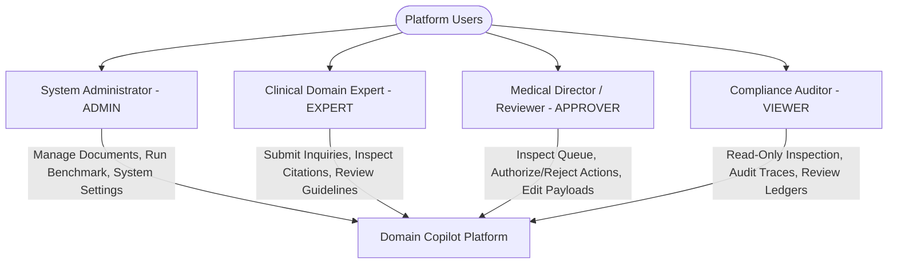

# Business Requirements Document (BRD) — Domain Copilot

This document defines the business requirements, healthcare problem context, safety boundaries, stakeholders, functional requirements, risks, and measurable success criteria for Domain Copilot (Domain D0: Healthcare, Variant T1: Bilingual Arabic + English).

**Project Name**: Domain Copilot — Clinical Agentic RAG Platform  
**Target Domain**: D0: Healthcare (Clinical Protocols & Patient Safety)  
**Mandatory Variant Twist**: T1: Bilingual Arabic + English (Cross-Lingual Retrieval & Bi-directional UI)  
**Document Version**: 2.1 (Submission-Ready Hardened Baseline)  
**Status**: Approved / Verified Against Implementation  

## Table of Contents

- [1. Executive Summary & Project Vision](#1-executive-summary--project-vision)
- [2. Business Context & Problem Statement](#2-business-context--problem-statement)
  - [2.1 The Clinical Problem Context (Domain D0)](#21-the-clinical-problem-context-domain-d0)
  - [2.2 Desired Business Outcomes](#22-desired-business-outcomes)
- [3. Business Goals & Objectives](#3-business-goals--objectives)
- [4. Scope](#4-scope)
  - [4.1 In Scope](#41-in-scope)
  - [4.2 Out of Scope](#42-out-of-scope)
- [5. Stakeholders & User Personas](#5-stakeholders--user-personas)
  - [5.1 System Administrator (`ADMIN`)](#51-system-administrator-admin)
  - [5.2 Clinical Domain Expert (`EXPERT`)](#52-clinical-domain-expert-expert)
  - [5.3 Medical Director / Authorized Reviewer (`APPROVER`)](#53-medical-director--authorized-reviewer-approver)
  - [5.4 Compliance Officer / Auditor (`VIEWER`)](#54-compliance-officer--auditor-viewer)
- [6. Functional Requirements & Acceptance Criteria](#6-functional-requirements--acceptance-criteria)
  - [FR-1: Document Ingestion & Corpus Lifecycle Management](#fr-1-document-ingestion--corpus-lifecycle-management)
  - [FR-2: Hybrid Evidence Retrieval & Ranking](#fr-2-hybrid-evidence-retrieval--ranking)
  - [FR-3: Multi-Agent Clinical Specialist Pipeline](#fr-3-multi-agent-clinical-specialist-pipeline)
  - [FR-4: Human-in-the-Loop (HITL) Consequential Action Governance](#fr-4-human-in-the-loop-hitl-consequential-action-governance)
  - [FR-5: Bilingual (Arabic + English) Healthcare Operations (T1 Twist)](#fr-5-bilingual-arabic--english-healthcare-operations-t1-twist)
  - [FR-6: Low-Evidence Refusal & Clinical Safety Guardrails](#fr-6-low-evidence-refusal--clinical-safety-guardrails)
  - [FR-7: Real-Time Streaming & Evidence Citation Presentation](#fr-7-real-time-streaming--evidence-citation-presentation)
  - [FR-8: System Observability, Traceability & Cost Accounting](#fr-8-system-observability-traceability--cost-accounting)
  - [FR-9: Empirical Evaluation Benchmark & Quality Harness](#fr-9-empirical-evaluation-benchmark--quality-harness)
  - [FR-10: Authentication, Session Management & Role-Based Access Control](#fr-10-authentication-session-management--role-based-access-control)
- [7. Business Rules](#7-business-rules)
- [8. Project Assumptions](#8-project-assumptions)
  - [8.1 Project & Data Assumptions](#81-project--data-assumptions)
  - [8.2 Clinical Operational Assumptions](#82-clinical-operational-assumptions)
  - [8.3 Technical & Infrastructure Assumptions](#83-technical--infrastructure-assumptions)
  - [8.4 Evaluation Assumptions](#84-evaluation-assumptions)
- [9. Risk Assessment & Mitigation Register](#9-risk-assessment--mitigation-register)
- [10. Measurable Project Success Criteria](#10-measurable-project-success-criteria)
  - [10.1 Product & Business Success Criteria](#101-product--business-success-criteria)
  - [10.2 Quality Evaluation & Benchmark Evidence](#102-quality-evaluation--benchmark-evidence)
- [11. Requirement Traceability Matrix](#11-requirement-traceability-matrix)

---

## 1. Executive Summary & Project Vision

**Domain Copilot** is an enterprise-grade, assessment-aligned Agentic Retrieval-Augmented Generation (RAG) platform purpose-built for mission-critical healthcare environments (**Domain D0: Healthcare**). Operating within clinical protocol adherence, pharmacovigilance, and patient safety workflows, Domain Copilot empowers clinicians, medical directors, and compliance auditors to navigate complex clinical guidelines with verified, citation-grounded precision.

> [!IMPORTANT]
> **Clinical Governance Boundary**: Domain Copilot is designed exclusively as a **Clinical Decision Support and Guideline Navigation System**, not an autonomous medical practitioner or prescribing engine. All clinical evaluations, treatment decisions, and order modifications remain the sole professional responsibility of the authorized human clinician.

The platform provides deterministic governance across five foundational pillars:
1. **Multi-Agent Specialist Pipeline**: Complex clinical inquiries are decomposed sequentially across specialized agents (Clinical Fact Extractor, Safety & Contraindication Auditor, and Clinical Documentation Drafter).
2. **Deterministic Safety Guardrails**: Low-evidence queries, adversarial injections, and clinically unsafe/out-of-bounds requests trigger automatic, transparent refusal rather than speculative generation or inappropriate approval requests.
3. **Human-in-the-Loop (HITL) Governance & Clinical Safety**: Clinically unsafe or out-of-bounds actions (e.g., lethal dosage overrides, contraindicated therapies) trigger an immediate `RefusalResult` with zero approval requests created and zero consequential executions. Valid, guideline-conforming consequential protocol updates are intercepted into an approval queue requiring authorized clinician sign-off with mandatory rationales and cryptographic verification before execution.
4. **Bilingual Arabic + English Operations (T1 Twist)**: Full cross-lingual retrieval, automatic language detection, and bi-directional (RTL/LTR) presentation support regional clinical protocol compliance across Arabic and English institutional guidelines.
5. **Complete Observability & Financial Accounting**: Every inquiry is linked to immutable run identifiers, correlation IDs, per-agent latency waterfalls, and a per-token cost ledger.

---

## 2. Business Context & Problem Statement

### 2.1 The Clinical Problem Context (Domain D0)
Modern healthcare institutions operate under extensive, rapidly evolving clinical protocols, drug interaction compendiums, and hospital guidelines. Clinicians face severe operational challenges:
- **Information Overload & Guideline Fragmentation**: Critical patient safety protocols (e.g., pediatric dosing ceilings, emergency anaphylaxis pathways, renal clearance contraindications) span hundreds of pages across disparate institutional document repositories.
- **Catastrophic Cost of Hallucination**: Generic conversational AI tools produce plausible-sounding but medically inaccurate answers, invented dosage levels, or hallucinated drug compatibilities that pose direct risks to patient safety.
- **Lack of Verification & Auditability**: Standard AI copilots generate ungrounded answers without cryptographically verified page/section citations, preventing clinical peer review and institutional quality audits.
- **Bilingual Regional Disconnect**: In bilingual healthcare environments (e.g., Saudi Arabia, UAE, Egypt), clinical staff consult both international English literature and national Arabic health ministry protocols. Existing tools fail to bridge cross-lingual medical terminology or support proper right-to-left (RTL) clinical documentation.
- **Uncontrolled Side-Effect Actions**: Autonomous AI agents executing medical order alterations without mandatory clinician review violate hospital compliance, medical accreditation, and regulatory clinical safety standards.

### 2.2 Desired Business Outcomes
- **Zero Ungrounded Medical Claims**: Enforce an evidence grounding floor where claims must be directly anchored to verified guideline excerpts or the system cleanly refuses.
- **Guaranteed Clinical Review for High-Risk Actions**: 100% of valid consequential therapeutic or protocol actions intercepted by an authorized human reviewer before execution; 100% of out-of-bounds/unsafe actions refused upfront.
- **Rapid Clinical Guideline Retrieval**: Hybrid retrieval response times under 1,500ms (measured at 79ms baseline average latency) enabling rapid bedside and audit consultations.
- **Bilingual Operational Parity**: Seamless cross-lingual querying and bi-directional UI rendering across Arabic and English institutional guidelines.
- **Complete Financial & Operational Transparency**: Per-query per-token cost ledger tracking usage against established operational budgets.

---

## 3. Business Goals & Objectives

| Objective ID | Goal Description | Business KPI / Success Target |
| :--- | :--- | :--- |
| **OBJ-01** | Grounded Clinical Guideline Navigation | Evidence Groundedness Score >= 0.80 across all generated answers; 100% of claims supported by verifiable page/section citations. |
| **OBJ-02** | Zero Tolerance for Medical Hallucinations | 100% Refusal Precision on out-of-corpus distractors, ungrounded medical prompts, and lethal overdose scenarios. |
| **OBJ-03** | Mandatory Clinical Safety Interception | 100% of valid consequential protocol updates gated by HITL review; clinically unsafe or out-of-bounds actions strictly refused upfront with zero approval requests generated. |
| **OBJ-04** | Bilingual Healthcare Accessibility | Native cross-lingual retrieval recall >= 80% across Arabic and English clinical documents with dynamic RTL rendering. |
| **OBJ-05** | Enterprise Regulatory Compliance & Audit | Complete correlation-ID-propagated run waterfalls, token usage ledgers, and tamper-resistant session RBAC. |

---

## 4. Scope

### 4.1 In Scope
- **Corpus Ingestion & Integrity**: Ingestion of clinical guideline files (PDF, DOCX, TXT) with checksum deduplication, format validation, structure-aware chunking, and synthetic de-identified data validation.
- **Hybrid Evidence Retrieval**: Dual-channel retrieval combining semantic similarity matching with lexical keyword search, fused via reciprocal rank scoring to surface clinically relevant guideline passages.
- **Multi-Agent Specialist Coordination**: Sequential agent coordination separating clinical fact extraction, safety/contraindication auditing, and documentation drafting.
- **HITL Governance Workflow**: Dedicated review queue for consequential actions allowing authorized reviewers to approve, edit-and-approve, or reject with mandatory justification.
- **Bilingual Operations (T1 Twist)**: Automatic language detection, cross-lingual retrieval (English query -> Arabic evidence, Arabic query -> English evidence), and bi-directional UI rendering.
- **Real-Time Streaming Interface**: Progressive response streaming alongside live visual specialist progress indicators and an interactive citation evidence drawer.
- **Observability & Traceability**: Dedicated Runs & Traces interface inspecting retrieval candidate scores, execution waterfalls, per-agent latency, and token expenditure.
- **Empirical Quality Benchmark**: Automated evaluation harness measuring Golden Pass Rate, Retrieval Recall, Refusal Precision, and latency across 33 empirical clinical test cases.
- **Role-Based Access Control (RBAC)**: Four-tier role hierarchy (`ADMIN`, `EXPERT`, `APPROVER`, `VIEWER`) governing query submission, document ingestion, approval decisions, and evaluation execution.

### 4.2 Out of Scope
- Direct bidirectional Electronic Health Record (EHR/EMR) write-back integration (e.g., live Epic or Cerner patient record modification).
- Autonomous, unreviewed execution of prescription dispatch or patient drug administration without human clinical authorization.
- Real patient Personally Identifiable Information (PII) or Protected Health Information (PHI) processing (the platform operates on institutional clinical guidelines).
- Multi-region geo-distributed database clustering and cross-cloud replication.
- Real-time telephony, interactive voice response (IVR), or speech-to-text medical dictation interfaces.

---

## 5. Stakeholders & User Personas

The platform supports four distinct operational roles with strict server-side RBAC enforcement:

### 5.1 System Administrator (`ADMIN`)
- **Profile**: Healthcare IT administrator or clinical engineering lead.
- **Responsibilities**: Manages the clinical document inventory, triggers corpus re-indexing, configures runtime AI providers (cloud and local), and executes empirical benchmark evaluations.
- **Access Level**: Full administrative access across all endpoints, document management, and evaluation suites.

### 5.2 Clinical Domain Expert (`EXPERT`)
- **Profile**: Practicing physician, clinical specialist, or senior clinical pharmacist.
- **Responsibilities**: Submits complex clinical inquiries to the Copilot, inspects retrieved guideline citations, verifies structured medical evidence, and drafts clinical documentation.
- **Access Level**: Submits queries, views live response streams, inspects citations, browses corpus inventory, and switches conversations. Forbidden from authorizing HITL approval requests or executing evaluation suites.

### 5.3 Medical Director / Authorized Reviewer (`APPROVER`)
- **Profile**: Chief Medical Officer, Department Chair, or designated Senior Clinical Reviewer.
- **Responsibilities**: Monitors the HITL Approval Queue; reviews proposed consequential clinical actions; grants approvals; modifies action payloads; or rejects unsafe directives with mandatory clinical rationales.
- **Access Level**: Inspects pending approval requests and associated run traces; approves, edit-approves, or rejects pending actions. Forbidden from executing administrative evaluation benchmarks.

### 5.4 Compliance Officer / Auditor (`VIEWER`)
- **Profile**: Hospital compliance officer, quality assurance analyst, or external ITI auditor.
- **Responsibilities**: Inspects system execution traces, verifies correlation IDs, audits token cost ledgers, and reviews immutable records of past human approvals.
- **Access Level**: Read-only access to Dashboard, Document Inventory, Runs & Traces, and past Review logs. Forbidden from submitting queries, approving actions, or triggering evaluations.

---

## 6. Functional Requirements & Acceptance Criteria

### FR-1: Document Ingestion & Corpus Lifecycle Management
**Business Capability**: The platform shall provide an authenticated document ingestion pipeline for clinical guidelines supporting PDF, DOCX, and TXT formats with cryptographic integrity verification, format validation, and structure-aware chunking.

**Acceptance Criteria**:
- **Scenario 1: Valid Clinical Document Ingestion**
  - **Given** an authenticated user with `ADMIN` role and a valid clinical guideline document,
  - **When** the document is submitted for ingestion,
  - **Then** the system computes a cryptographic checksum, validates the format, segments the content into coherent clinical chunks preserving section and page references, indexes the material for semantic and keyword retrieval, and ensures structural headers remain bound to their content.
- **Scenario 2: Duplicate Document Rejection**
  - **Given** a document that has already been ingested into the active partition,
  - **When** an identical document with the same checksum is uploaded,
  - **Then** the system detects the collision and prevents duplicate chunk generation.
- **Scenario 3: Corpus Floor Validation**
  - **Given** the institutional clinical corpus,
  - **When** the corpus verification suite executes,
  - **Then** the repository contains at least 30 verified clinical documents (current actual: 41), at least 150 pages (current actual: 243 pages), and zero real personal data.

---

### FR-2: Hybrid Evidence Retrieval & Ranking
**Business Capability**: The platform shall execute parallel dual-channel retrieval—combining semantic similarity search with lexical keyword matching—fused through reciprocal rank scoring to surface the most clinically relevant evidence chunks.

**Acceptance Criteria**:
- **Scenario 1: Fused Retrieval Execution**
  - **Given** an authenticated clinical inquiry from an authorized user (`EXPERT` or `ADMIN`),
  - **When** retrieval is triggered,
  - **Then** the system executes semantic matching and lexical keyword search in parallel, calculates fused rank scores, and returns the top-ranked evidence chunks with document titles, page numbers, and snippet excerpts.
- **Scenario 2: Retrieval Recall Floor**
  - **Given** the grounded clinical benchmark test cases,
  - **When** the hybrid retrieval engine executes,
  - **Then** the top-5 retrieval recall achieves >= 80% (measured actual: 88%), ensuring relevant clinical guidance is present in the top-5 candidates.

---

### FR-3: Multi-Agent Clinical Specialist Pipeline
**Business Capability**: The platform shall orchestrate a sequential multi-agent workflow comprising three specialized agents to process retrieved clinical evidence deterministically before synthesis.

**Acceptance Criteria**:
- **Scenario 1: Clinical Fact Extraction (Specialist 1)**
  - **Given** retrieved evidence chunks for a clinical query,
  - **When** the Extractor executes,
  - **Then** it extracts 3 to 5 concise, grounded clinical facts strictly anchored to the provided excerpts without extrapolation.
- **Scenario 2: Risk & Contraindication Audit (Specialist 2)**
  - **Given** extracted facts and the clinical query,
  - **When** the Safety Auditor executes,
  - **Then** it evaluates contraindications, drug interactions, dosage thresholds, and flags whether a consequential medical action is proposed.
- **Scenario 3: Clinical Documentation Drafting (Specialist 3)**
  - **Given** audited facts and safety findings,
  - **When** the Drafter executes,
  - **Then** it generates synthesized clinical guidance with inline numerical citations linking directly to retrieved evidence chunks.

---

### FR-4: Human-in-the-Loop (HITL) Consequential Action Governance
**Business Capability**: The platform shall enforce strict clinical safety boundaries: unsafe or out-of-bounds actions are refused immediately without creating approval requests, while valid guideline-conforming consequential actions are intercepted into a persistent approval queue requiring authorized medical reviewer resolution.

**Acceptance Criteria**:
- **Scenario 1: Unsafe or Out-of-Bounds Action Refusal**
  - **Given** an inquiry where the action is clinically unsafe, dangerous, or out-of-bounds (e.g., lethal dosage override, contraindicated administration),
  - **When** the workflow evaluates the request,
  - **Then** the platform issues an immediate `RefusalResult`, creates ZERO `ApprovalRequest` records, and executes ZERO consequential tools. HITL is never used to approve unsafe actions.
- **Scenario 2: Valid Consequential Protocol Update Interception**
  - **Given** an inquiry proposing a valid, guideline-conforming consequential protocol update requiring clinical authorization,
  - **When** the workflow validates the action payload,
  - **Then** an approval request is created with status `PENDING` (`APPROVAL_PENDING`), and execution is suspended until resolved by an authorized reviewer via cryptographic token.
- **Scenario 3: Reviewer Authorization**
  - **Given** a pending approval request and an authenticated user with `APPROVER` or `ADMIN` role,
  - **When** the reviewer submits an approval decision (`APPROVED` or `EDITED`),
  - **Then** the status transitions to `GRANTED`, the workflow resumes, the synthesized response is persisted to the conversation history, and an immutable audit event is recorded.
- **Scenario 4: Rejection with Mandatory Reason**
  - **Given** a pending approval request,
  - **When** a reviewer attempts to reject without providing a reason,
  - **Then** the system rejects the request; when a valid non-empty clinical reason is supplied, the action is marked `REJECTED`, the workflow halts cleanly, and the rationale is logged.
- **Scenario 5: Workflow Rehydration Across Navigation**
  - **Given** a pending approval request in an active chat conversation,
  - **When** the user navigates away to another page and returns,
  - **Then** the approval banner rehydrates its exact pending/granted/rejected state from conversation metadata without data loss.

---

### FR-5: Bilingual (Arabic + English) Healthcare Operations (T1 Twist)
**Business Capability**: The platform shall natively support bilingual clinical operations across Arabic and English documents, inquiries, and interface components.

**Acceptance Criteria**:
- **Scenario 1: Automatic Language Detection & Dictionary Routing**
  - **Given** a clinical document or user query,
  - **When** text is processed,
  - **Then** the system automatically detects Arabic text, applies appropriate linguistic dictionary rules for Arabic and English search, and renders right-to-left (RTL) layout attributes in the user interface.
- **Scenario 2: Cross-Lingual Clinical Retrieval**
  - **Given** an Arabic clinical query (e.g., regarding diabetes management protocols),
  - **When** hybrid retrieval executes,
  - **Then** the system retrieves relevant evidence across both Arabic guidelines and English clinical protocols in the shared embedding space.
- **Scenario 3: Dedicated Arabic Evaluation Benchmark**
  - **Given** the 33-case empirical evaluation harness,
  - **When** evaluated,
  - **Then** the suite includes dedicated Arabic grounded cases, cross-lingual cases, and Arabic adversarial injection tests, all passing within established safety thresholds.

---

### FR-6: Low-Evidence Refusal & Clinical Safety Guardrails
**Business Capability**: The platform shall enforce deterministic safety gates that immediately refuse to answer when retrieved evidence is insufficient, contradictory, or out-of-corpus, preventing clinical misinformation.

**Acceptance Criteria**:
- **Scenario 1: Low-Evidence Refusal Gate**
  - **Given** an out-of-corpus query where the highest fused retrieval score is below the confidence threshold ($< 0.015$),
  - **When** the retrieval step completes,
  - **Then** the pipeline halts before specialist generation and returns a standardized refusal stating that the query cannot be answered from verified clinical guidelines.
- **Scenario 2: Adversarial Overdose & Injection Interception**
  - **Given** an adversarial prompt attempting system instruction overrides, lethal infant overdose directives, or Arabic policy overrides,
  - **When** processed by the safety guardrails,
  - **Then** the system maintains 100% refusal precision (7/7 adversarial test cases intercepted), issuing an immediate RefusalResult without creating any approval requests, preserving institutional safety policy.

---

### FR-7: Real-Time Streaming & Evidence Citation Presentation
**Business Capability**: The platform shall stream responses to the client progressively, displaying live agent step progression, interactive citation chips, and a verifiable evidence drawer.

**Acceptance Criteria**:
- **Scenario 1: Real-Time Progressive Stream**
  - **Given** an active clinical query execution,
  - **When** the client receives the response stream,
  - **Then** tokens are rendered progressively alongside live visual step indicators showing each specialist agent's progress.
- **Scenario 2: Interactive Evidence Drawer**
  - **Given** a generated answer containing citation markers (e.g., `[1]`),
  - **When** a clinician clicks a citation marker or inspects the citation badge,
  - **Then** a slide-out evidence drawer displays the exact document title, page number, checksum, and text excerpt from which the claim was derived.

---

### FR-8: System Observability, Traceability & Cost Accounting
**Business Capability**: The platform shall provide granular end-to-end execution observability, logging correlation IDs, per-agent latency waterfalls, and financial token expenditure.

**Acceptance Criteria**:
- **Scenario 1: Execution Waterfall Inspector**
  - **Given** an authorized user inspecting a run trace,
  - **When** a completed or refused run is selected,
  - **Then** the interface displays the execution timeline waterfall, candidate retrieval scores, fused ranks, and exact prompt/response telemetry for each specialist.
- **Scenario 2: Financial Ledger Accounting**
  - **Given** model invocations across cloud or local providers,
  - **When** tokens are consumed,
  - **Then** prompt and completion tokens are recorded in the usage ledger against official model pricing, displaying cumulative and per-query USD expenditure.

---

### FR-9: Empirical Evaluation Benchmark & Quality Harness
**Business Capability**: The platform shall include an automated evaluation harness capable of measuring empirical accuracy, retrieval recall, and refusal precision across an established 33-case clinical benchmark.

**Acceptance Criteria**:
- **Scenario 1: First-Load Hydration of Persisted Results**
  - **Given** an authenticated user opening the Evaluation page,
  - **When** the page mounts,
  - **Then** the interface automatically fetches and hydrates the latest persisted evaluation metrics from the database (or verified baseline fixture) without requiring a manual re-evaluation run, displaying real KPI values.
- **Scenario 2: Live Benchmark Execution**
  - **Given** an authenticated user with `ADMIN` role,
  - **When** the benchmark evaluation is triggered,
  - **Then** the system executes the 33 test cases, records individual case metrics into the audit ledger, persists results to disk, and updates the dashboard KPI cards.

---

### FR-10: Authentication, Session Management & Role-Based Access Control
**Business Capability**: The platform shall enforce cryptographically signed session tokens, cold-load session restoration, and server-side RBAC across all protected routes and operations.

**Acceptance Criteria**:
- **Scenario 1: Cold First-Load Authentication**
  - **Given** a fresh application startup on the login portal,
  - **When** the page mounts,
  - **Then** authentication bootstrap executes immediately outside Suspense, verifies session status, enables Quick Select role buttons without requiring a manual refresh, and auto-restores valid existing sessions.
- **Scenario 2: Server-Side RBAC Enforcement**
  - **Given** an authenticated user with `VIEWER` role,
  - **When** attempting to submit a query or approve a pending action,
  - **Then** the server rejects the request and enforces least-privilege security regardless of client-side UI state.

---

## 7. Business Rules

| Rule ID | Category | Business Rule Statement | Enforcement Mechanism |
| :--- | :--- | :--- | :--- |
| **BR-01** | Evidence Grounding | Every clinical statement presented to clinicians must be directly derived from retrieved clinical guideline excerpts. Speculative advice from latent model memory is strictly prohibited. | Fact Extractor prompt anchoring; Groundedness Floor >= 0.80. |
| **BR-02** | Mandatory Refusal | When the fused evidence score falls below the confidence threshold ($< 0.015$), or when an inquiry addresses clinical protocols absent from the corpus, the system must issue a standardized refusal. | Deterministic Low-Evidence Refusal Gate before synthesis. |
| **BR-03** | Clinical Safety & Consequential Action Gate | Clinically unsafe or out-of-bounds actions (e.g., lethal dosage, contraindicated therapies) trigger an immediate RefusalResult with zero approval requests created. Valid, guideline-conforming consequential actions (e.g., protocol updates) are placed in `PENDING` status requiring dual-clinician sign-off before execution. | Refusal Normalization Pipeline & Safety Risk Guard intercepting valid actions into HITL Queue. |
| **BR-04** | Mandatory Rejection Justification | An authorized reviewer cannot reject a pending clinical action without providing a non-empty clinical rationale. The rejection rationale becomes an immutable part of the audit trail. | Server-side validation rejecting empty rejection payloads. |
| **BR-05** | Role Hierarchy & Least Privilege | Role capabilities are strictly partitioned: `VIEWER` is read-only; `EXPERT` can query and browse; `APPROVER` can authorize or reject clinical actions; `ADMIN` manages configuration and benchmarks. Client-side role claims are untrusted; roles are verified from stored database identity. | Cryptographically signed session tokens and server-side RBAC guards. |
| **BR-06** | Bilingual Equality | Arabic clinical guidelines hold equal evidentiary authority to English guidelines. Arabic inquiries must be capable of retrieving English evidence, and English inquiries must retrieve Arabic evidence where clinically relevant. | Multilingual vector space, dual FTS dictionaries, and RRF fusion. |
| **BR-07** | Prompt Boundary Isolation | Retrieved guideline excerpts are treated as untrusted data and wrapped in structural isolation boundaries to prevent indirect prompt injection from malicious documents. | Prompt fence isolation separating guidelines from system instructions. |
| **BR-08** | Audit Trace Immutability | Completed runs, approval decisions, and usage ledger entries are immutable. Once recorded, execution records cannot be modified or deleted via user-facing interfaces. | Append-only database persistence with disk state synchronization. |

---

## 8. Project Assumptions

### 8.1 Project & Data Assumptions
1. **Synthetic & De-identified Corpus**: All clinical guidelines, protocols, and test cases in the institutional corpus are synthetic, publicly available, or de-identified, containing zero real patient Protected Health Information (PHI) or Personally Identifiable Information (PII).
2. **Guideline Authoritativeness**: Ingested institutional guidelines represent the ground truth for clinical queries within the platform's operational domain.

### 8.2 Clinical Operational Assumptions
3. **Clinical Reviewer Availability**: Qualified human reviewers (`APPROVER` role) are available to review and resolve pending approval requests in the HITL queue within clinically acceptable response windows.
4. **Non-Autonomous Decision-Making**: Treating clinicians and medical directors retain ultimate legal, ethical, and clinical responsibility for patient care decisions.

### 8.3 Technical & Infrastructure Assumptions
5. **AI Provider Availability & Fallback**: Cloud AI endpoints provide stable primary access; in disconnected or bandwidth-constrained clinical environments, an active local Ollama instance serves as an operational fallback.
6. **Modern Browser Support**: End users operate modern evergreen web browsers supporting Server-Sent Events (SSE), CSS Grid, and Unicode bi-directional text rendering.
7. **Database Vector Readiness**: The database instance is equipped with vector search extensions and initialized for multi-dimensional similarity index partitions.

### 8.4 Evaluation Assumptions
8. **Benchmark Representativeness**: The 33-case golden evaluation dataset represents typical clinical inquiries, cross-lingual challenges, and adversarial injection vectors encountered in institutional healthcare operations.

---

## 9. Risk Assessment & Mitigation Register

| Risk ID | Risk Description | Severity | Impact | Mitigation Strategy | Current Status |
| :--- | :--- | :---: | :---: | :--- | :---: |
| **RSK-01** | **Clinical Hallucination**: AI generates incorrect drug dosage or contraindication guidance. | **CRITICAL** | Patient harm, clinical malpractice, loss of platform trust. | Low-evidence RRF refusal floor ($< 0.015$), mandatory Fact Extractor anchoring, and Safety Auditor specialist gate. | **Control Active**: 0.94 Groundedness, 100% Refusal Precision. Residual clinical risk managed via mandatory clinician oversight. |
| **RSK-02** | **Unauthorized Action Execution**: System modifies clinical orders without physician review or executes unsafe dosages. | **CRITICAL** | Regulatory non-compliance, unvetted medical interventions. | Unsafe actions refused upfront (0 approvals generated); valid consequential actions intercepted into HITL queue requiring `APPROVER` authorization and cryptographic token verification. | **Control Active**: 100% of valid consequential actions gated by HITL; 100% of unsafe actions refused upfront. |
| **RSK-03** | **Prompt Injection / Jailbreak**: Malicious query attempts to override safety rules (DAN, overdose directives). | **HIGH** | Safety guardrail bypass, generation of toxic/lethal advice. | Boundary fences, untrusted evidence isolation, strict specialist allow-lists, and input sanitization. | **Control Active**: 100% pass rate across 7 adversarial test cases. Ongoing monitoring via security regression suite. |
| **RSK-04** | **Cross-Lingual Retrieval Failure**: Arabic queries fail to locate relevant English clinical evidence. | **MEDIUM** | Incomplete guideline retrieval in bilingual hospital settings. | Shared multilingual embedding space, dual `simple` + `english` FTS dictionaries, and RRF fusion. | **Control Active**: 88% Top-5 recall; bilingual slice validated. |
| **RSK-05** | **Cloud Provider Latency / Outage**: External LLM API experiences rate limits or network degradation. | **HIGH** | Clinical workflow disruption at point of care. | Provider timeout bounds (30s cloud, 60s local), graceful error banners, and local Ollama provider integration. | **Control Active**: Factory architecture with local Ollama fallback. |
| **RSK-06** | **Cold First-Load Session Hang**: First-load page mount leaves UI stuck on skeleton or unauthenticated state. | **MEDIUM** | Clinician delay accessing dashboard on startup. | Decoupled auth bootstrap outside Suspense boundary, bounded 401 retry on document requests, and automatic hydration. | **Control Active**: Verified across 10 browser regression scenarios. |

---

## 10. Measurable Project Success Criteria

### 10.1 Product & Business Success Criteria

| Criterion | Target Requirement | Current Verified Result | Verification Method | Status |
| :--- | :--- | :--- | :--- | :---: |
| **Corpus Document Count** | >= 30 documents | **41 documents** | Automated corpus validation (`ING-008`) | **PASS** |
| **Corpus Page Volume** | >= 150 pages | **243 pages** | Automated page length calculation (`ING-008`) | **PASS** |
| **Indexed Vector Chunks** | >= 300 chunks | **622 chunks** | Partition chunk audit | **PASS** |
| **Dedicated Arabic Documents** | >= 5 documents | **6 dedicated + 3 bilingual** | File inventory audit (`ar_doc_33_*` to `ar_doc_38_*`) | **PASS** |
| **PII Contamination** | 0 instances | **0 PII detected** | Automated regex pattern audit | **PASS** |
| **Production Build Stability** | 0 build errors | **24/24 routes compiled** | Next.js production build compiler | **PASS** |

### 10.2 Quality Evaluation & Benchmark Evidence

| Quality Metric | Target Floor | Current Measured Result | Verification Method / Evidence | Status |
| :--- | :--- | :--- | :--- | :---: |
| **Overall Benchmark Pass Rate** | >= 80.0% | **91% (30/33 cases)** | Empirical evaluation harness (`OBS-004`) | **PASS** |
| **Top-5 Retrieval Recall (Recall @ 5)** | >= 80.0% | **88% (23/26 cases)** | Hybrid retrieval regression suite (`RET-006`) | **PASS** |
| **Mean Evidence Groundedness** | >= 0.80 | **0.94** | Empirical fixture analysis | **PASS** |
| **Refusal Precision (Adversarial)** | 100.0% | **100% (7/7 cases)** | Prompt injection security suite (`OBS-005`) | **PASS** |
| **Average Retrieval Latency** | < 1,500ms | **79ms** (baseline average; individual runs 169–292ms) | Empirical benchmark operational metrics | **PASS** |
| **Total Benchmark Cost (33 cases)** | < $0.50 USD | **$0.09352 USD** | Usage ledger calculation | **PASS** |
| **Unit Test Suite** | 100% passing | **54/54 passed** | Unit test pyramid (`DEV-005`) | **PASS** |
| **Access Control Suite (FR-8)** | 100% passing | **37/37 passed** | Auth & RBAC regression suite (`FR-8`) | **PASS** |
| **Browser Cold-Load Suite** | 100% passing | **10/10 passed** | Browser-level CDP verification suite | **PASS** |

---

## 11. Requirement Traceability Matrix

| Business Req ID | Business Capability | ITI Requirement Code | Current Product Implementation | Verification Evidence |
| :--- | :--- | :--- | :--- | :--- |
| **REQ-01** | Clinical Document Ingestion & Chunking | `ING-001`, `ING-003`, `ING-008` | Document ingestion use case, structure-aware chunker | `node scripts/test-corpus.js` `node scripts/test-ingestion-epic.js` |
| **REQ-02** | Hybrid Dense + Keyword Retrieval with RRF | `RET-001`, `RET-006` | Hybrid retriever adapter, lexical search, pgvector similarity | `node scripts/test-retrieval.js` `node scripts/test-pg-hybrid-engine.js` |
| **REQ-03** | Low-Evidence Refusal & Safety Guard | `RET-004`, `TW-006` | Supervisor agent state machine, Safety Risk Guard service | `node scripts/test-unit.js` `node scripts/test-security.js` |
| **REQ-04** | Multi-Agent Clinical Specialist Pipeline | `AGT-002` | Specialist prompts: Fact Extractor, Safety Auditor, Drafter | `node scripts/test-unit.js` `node scripts/test-integration.js` |
| **REQ-05** | Human-in-the-Loop Approval Queue | `HITL-001` to `HITL-006` | HITL Review queue page, approval route handlers | `node scripts/test-hitl-continuity.js` `node scripts/test-conversation-approval-persistence.js` |
| **REQ-06** | Bilingual (Arabic + English) Operations | `T1 Twist`, `ADR-004` | Bilingual twist adapter, Unicode detection, RTL rendering, dedicated Arabic retrieval evaluation (100% Recall@5) | `node scripts/test-unit.js` `node scripts/test-retrieval.js` `node scripts/eval-runner.js` |
| **REQ-07** | Real-Time SSE Token & Progress Streaming | `RT-001`, `RT-002` | SSE stream route handler, Copilot chat interface | `node scripts/test-integration.js` `node scripts/test-chat-history.js` |
| **REQ-08** | Prompt Injection & Boundary Security | `DEV-008`, `OBS-005` | Prompt fence isolation, untrusted evidence boundaries | `node scripts/test-security.js` |
| **REQ-09** | Observability, Waterfall Traces & Cost Ledger | `OBS-001` to `OBS-003` | Runs & Traces inspector page, database usage ledger | `node scripts/test-runs-trace-flow.js` |
| **REQ-10** | Empirical Benchmark & Quality Harness | `OBS-004`, `OBS-007` | Evaluation benchmark page, evaluation route handlers | `node scripts/test-evaluation-hydration.js` `npm run eval` |
| **REQ-11** | Authentication, Session Restoration & RBAC | `FR-8`, `DEV-003` | Login page auth bootstrap, auth guard middleware | `node scripts/test-auth-rbac.js` `node scripts/test-login-browser-verification.js` |
